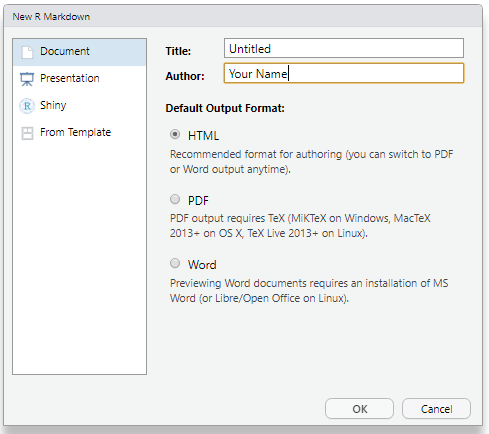
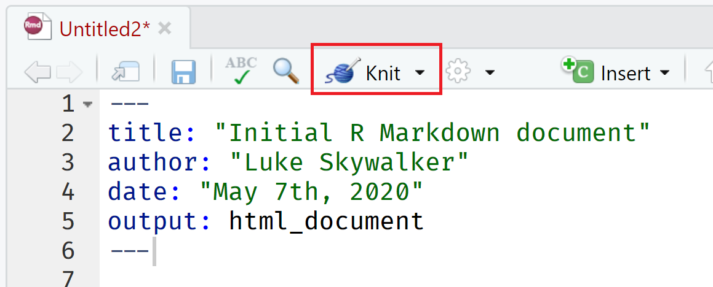

```{r, include=FALSE}
source("bin/chunk-options.R")
knitr_fig_path("10-")
```


# Data analysis reports

Data analysts tend to write a lot of reports, describing their
analyses and results, for their collaborators or to document their
work for future reference.

Many new users begin by first writing a single R script containing all of the
work. Then simply share the analysis by emailing the script and various graphs
as attachments. But this can be cumbersome, requiring a lengthy discussion to
explain which attachment was which result.

Writing formal reports with Word or [LaTeX](http://www.latex-project.org/)
can simplify this by incorporating both the analysis report and output graphs 
into a single document. But tweaking formatting to make figures look correct
and fix obnoxious page breaks can be tedious and lead to a lengthly "whack
a mole" game of fixing new mistakes resulting from a single formatting change.

Creating a web page (as an html file) by using R Markdown makes things easier.
The report can be one long stream, so tall figures that wouldn't ordinary fit on
one page can be kept full size and easier to read, since the reader can simply
keep scrolling. Formatting is simple and easy to modify, allowing you to spend
more time on your analyses instead of writing reports.


## Literate programming

Ideally, such analysis reports are _reproducible_ documents: If an
error is discovered, or if some additional subjects are added to the
data, you can just re-compile the report and get the new or corrected
results (versus having to reconstruct figures, paste them into
a Word document, and further hand-edit various detailed results).

The key R package is [`knitr`](http://yihui.name/knitr/). It allows you
to create a document that is a mixture of text and chunks of
code. When the document is processed by `knitr`, chunks of code will
be executed, and graphs or other results inserted into the final document.

This sort of idea has been called "literate programming".

`knitr` allows you to mix basically any sort of text with code from different programming languages, but we recommend that you use `R Markdown`, which mixes Markdown
with R. [Markdown](https://www.markdownguide.org/) is a light-weight mark-up language for documents and web pages.

## Example of Using R Markdown in the BC Government

R Markdown is quite versatile. Below are some examples of ways you can adapt it for a variety of purposes. 

### Documentation
- Rendered: https://bcgov.github.io/bcdata/articles/bcdata.html
- R Markdown: https://github.com/bcgov/bcdata/blob/master/vignettes/bcdata.Rmd

### Teaching
- Rendered: https://bcgov.github.io/ds-intro-to-r-2-day/
- R Markdown: https://github.com/bcgov/ds-intro-to-r-2-day/blob/master/01-rstudio-intro.Rmd

### Presentation
- Rendered: https://bcgov.github.io/bcgov-rstats-public-presentations/2020-03-26_bcdata_lunch_and_learn/bcdata-2020-lunch-and-learn.html#1
- R Markdown: https://github.com/bcgov/bcgov-rstats-public-presentations/blob/master/2020-03-26_bcdata_lunch_and_learn/bcdata-2020-lunch-and-learn.Rmd


> ## Challenge 1 (5 minutes)
>
> Take a few minutes to discuss in your groups the typical ways in which
> you share results. What you do you do in the scenario where the data changes
> but the analysis needs to be the same?
>
> 

## Creating an R Markdown file

Within RStudio, click File &rarr; New File &rarr; R Markdown and
you'll get a dialog box like this:



You can stick with the default (HTML output), but give it a title and an author=.


## Basic components of R Markdown

The initial chunk of text (header) contains instructions for R to specify what kind of document will be created, and the options chosen. You can use the header to give your document a title, author, date, and tell it that you're going to want
to produce html output (in other words, a web page).

```
---
title: "Initial R Markdown document"
author: "Luke Skywalker"
date: "May 7th, 2020"
output: html_document
---
```

You can delete any of those fields if you don't want them
included. The double-quotes aren't strictly _necessary_ in this case.
They're mostly needed if you want to include a colon in the title.

RStudio creates the document with some example text to get you
started. Note below that there are chunks like

<pre>
&#96;&#96;&#96;{r}
summary(cars)
&#96;&#96;&#96;
</pre>

These are chunks of R code that will be executed by `knitr` and replaced
by their results. More on this later.

Also note the web address that's put between angle brackets (`< >`) as
well as the double-asterisks in `**Knit**`. This is
[Markdown](http://daringfireball.net/projects/markdown/syntax).

## Markdown

Markdown is a system for writing web pages by marking up the text much
as you would in an email rather than writing html code. The marked-up
text gets _converted_ to html, replacing the marks with the proper
html code.

For now, let's delete all of the stuff that's there and write a bit of
markdown.

You make things **bold** using two asterisks, like this: `**bold**`,
and you make things _italics_ by using underscores, like this:
`_italics_`.

You can make a bulleted list by writing a list with hyphens or
asterisks, like this:

```
* bold with double-asterisks
* italics with underscores
* code-type font with backticks
```

or like this:

```
- bold with double-asterisks
- italics with underscores
- code-type font with backticks
```

Each will appear as:

- bold with double-asterisks
- italics with underscores
- code-type font with backticks

You can use whatever method you prefer, but *be consistent*. This maintains the
readability of your code.

You can make a numbered list by just using numbers. You can even use the
same number over and over if you want:

```
1. bold with double-asterisks
1. italics with underscores
1. code-type font with backticks
```

This will appear as:

1. bold with double-asterisks
1. italics with underscores
1. code-type font with backticks

You can make section headers of different sizes by initiating a line
with some number of `#` symbols:

```
# Title
## Main section
### Sub-section
#### Sub-sub section
```

You _compile_ the R Markdown document to an html webpage by clicking
the "Knit" button in the upper-left.



> ## Challenge 2
>
> Create a new R Markdown document. Delete all of the R code chunks
> and write a bit of Markdown (some sections, some italicized
> text, and an itemized list).
>
> Convert the document to a webpage.
>
> > ## Solution to Challenge 2
> >
> > In RStudio, select File > New file > R Markdown... 
> > 
> > Delete the placeholder text and add the following:
> > 
> > ```
> > # Introduction
> > 
> > ## Background on Data
> > 
> > This report uses the *gapminder* dataset, which has columns that include:
> > 
> > * country
> > * continent
> > * year
> > * lifeExp
> > * pop
> > * gdpPercap
> > 
> > ## Background on Methods
> > 
> > ```
> > 
> > Then click the 'Knit' button on the toolbar to generate an html document (webpage).


### A bit more Markdown

You can make a hyperlink like this:
`[text to show](http://the-web-page.com)`.

You can include an image file like this: ``

You can do subscripts (e.g., F~2~) with `F~2~` and superscripts (e.g.,
F^2^) with `F^2^`.

If you know how to write equations in
[LaTeX](http://www.latex-project.org/), you can use `$ $` and `$$ $$` to insert math equations, like
`$E = mc^2$` and

```
$$y = \mu + \sum_{i=1}^p \beta_i x_i + \epsilon$$
```

You can review Markdown syntax by navigating to the
"Markdown Quick Reference" under the "Help" field in the 
toolbar at the top of RStudio.

### R code chunks

The real power of Markdown comes from
mixing markdown with chunks of code. This is R Markdown. When
processed, the R code will be executed; if they produce figures, the
figures will be inserted in the final document.

The main code chunks look like this:

<pre>
&#96;&#96;&#96;{r load_data}
library("readr")
gapminder <- read_csv("data/gapminder_data.csv")
&#96;&#96;&#96;
</pre>

That is, you place a chunk of R code between <code>&#96;&#96;&#96;{r chunk_name}</code>
and <code>&#96;&#96;&#96;</code>. You should give each chunk
a unique name, as they will help you to fix errors and, if any graphs are
produced, the file names are based on the name of the code chunk that
produced them.


## How R Markdown gets compiled


When you press the "Knit" button [`knitr`](http://yihui.name/knitr) will process your R Markdown file to create a plain Markdown document (along with a set of figure files if needed).


If we specified our output document to be a html file, the Markdown file (and figure documents) is then converted or rendered to a html file using the tool [`pandoc`](http://pandoc.org/). 


```{r rmd_to_html_fig, fig.width=8, fig.height=3, fig.align="left", echo=FALSE}
par(mar=rep(0, 4), bty="n", cex=1.5)
plot(0, 0, type="n", xlab="", ylab="", xaxt="n", yaxt="n",
     xlim=c(0, 100), ylim=c(0, 100))
xw <- 10
yh <- 35
xm <- 12
ym <- 50
rect(xm-xw/2, ym-yh/2, xm+xw/2, ym+yh/2, lwd=2)
text(xm, ym, ".Rmd")

xm <- 50
ym <- 80
rect(xm-xw/2, ym-yh/2, xm+xw/2, ym+yh/2, lwd=2)
text(xm, ym, ".md")
xm <- 50; ym <- 25
for(i in c(2, 0, -2))
    rect(xm-xw/2+i, ym-yh/2+i, xm+xw/2+i, ym+yh/2+i, lwd=2,
         border="black", col="white")
text(xm-2, ym-2, "figs/")

xm <- 100-12
ym <- 50
rect(xm-xw/2, ym-yh/2, xm+xw/2, ym+yh/2, lwd=2)
text(xm, ym, ".html")

arrows(22, 50, 38, 50, lwd=2, col="slateblue", len=0.1)
text((22+38)/2, 60, "knitr", col="darkslateblue", cex=1.3)

arrows(62, 50, 78, 50, lwd=2, col="slateblue", len=0.1)
text((62+78)/2, 60, "pandoc", col="darkslateblue", cex=1.3)
```

Different output document types require different tool for conversion. This will be discused below. 

## Chunk options
 
As we saw above, code chunks are a very important part of using R Markdown. We will now explore some of the options for controlling how these will show up in our document. 

Firstly we need name our code chunk name. By default all code chunks are blank. ie: 

<pre>
&#96;&#96;&#96;{r}
&#96;&#96;&#96;
</pre>


It is recomended to use a descriptive name such as'load_data' or 'read_libraries'. This will help you break up your code chunks and ensure each chunk has a unique name.  

<pre>
&#96;&#96;&#96;{r load_libraries}
library("dplyr")
library("ggplot2")
&#96;&#96;&#96;
</pre>


We can control how the code and the resulting outputs are shown in the final output by changing the code chunk options which follow the title. For example: 

<pre>
&#96;&#96;&#96;{r load_libraries, eval = FALSE, echo = TRUE}
library("dplyr")
library("ggplot2")
&#96;&#96;&#96;
</pre>


There are many different options you can adjust. More details can be found on the R Markdown cheatsheet or [here](https://yihui.org/knitr/options/#code-evaluation). 
 
The ones you need to know first are: 

- `cache`: TRUE/FALSE. Do you want the output of the chunk saved so you dont have to run it next time?
- `eval`: Do you want to code to be evaluated?
- `echo`: Do you want to print the code? 
- `include`: Do you want to include the code in the output document? 
- `warning=FALSE` and `message=FALSE` : Do you want to hide any warnings or messages? 
- `fig.height` and `fig.width` : Do you want to set figures sizes (inches)?


> Tips: Finding help with chunk options
> You can review all of the `R` chunk options by navigating to
> the "R Markdown Cheat Sheet" under the "Cheatsheets" section 
> of the "Help" field in the toolbar at the top of RStudio.
>


Lets create a code chunk. Firstly add a name `addup` and set the `eval` parameter to `TRUE`. 

<pre>
&#96;&#96;&#96;{r addup, eval = TRUE}
1 + 1
&#96;&#96;&#96;
</pre>

When we knit the document we can see both the code and the result: 

```{r adds, eval = TRUE}

1 + 1 

```


If we dont want the code to appear in the output we can use the  `echo` parameters.

<pre>
&#96;&#96;&#96;{r addup, eval = TRUE, echo = FALSE}
1 + 1
&#96;&#96;&#96;
</pre>

When knit the document will now only show the result and will hide the code.

```{r addup, eval = TRUE, echo = FALSE}
1 + 1 
```

### Global options

Often there will be particular options that you'll want to use
repeatedly; for this, you can set _global_ chunk options, like so:

<pre>
&#96;&#96;&#96;{r global_options, echo=FALSE}
knitr::opts_chunk$set(fig.path="Figs/", 
                      message=FALSE, 
                      warning=FALSE,
                      echo=FALSE, 
                      results="hide", 
                      fig.width=11)
&#96;&#96;&#96;
</pre>


### Formatting figures 

We can use paramaters to control the location and size of plots using `fig.height`,`fig.width`
and `fig.align`. We can also use `fig.cap` to add a title. 


We can use the **gapminder** dataset and `ggplot2`package to create and format a plot within R Markdown. 

<pre>
&#96;&#96;&#96;{r pretty_plot, eval = TRUE, echo = FALSE, fig.cap = "A nice descriptive title"}

library("readr")
library("ggplot2")

gapminder <- read_csv("data/gapminder_data.csv")

ggplot(data = gapminder, mapping = aes(x = gdpPercap, y = lifeExp)) +
  geom_point()
  
&#96;&#96;&#96;
</pre>


```{r plot1, eval = TRUE, echo = FALSE , message=FALSE, fig.cap = "A nice descriptive title", fig.width =5, fig.height = 5}
library(readr)
library(ggplot2)
gapminder <- read_csv("data/gapminder_data.csv")
ggplot(data = gapminder, mapping = aes(x = gdpPercap, y = lifeExp)) +
  geom_point()
```


> ## Challenge 4
>
> Generate a plot using the **gapminder** dataset and `ggplot2` package. Use the chunk options to control the size and alignment of the figure.
> 
> > ## Solution to Challenge 4
> > 
> > <pre>
> > &#96;&#96;&#96;{r pretty_plot, eval = TRUE, echo = FALSE, fig.cap= "Pretty Plot", fig.width = 5, fig.height = 5, fig.align = 'centre'}
> > ggplot(data = gapminder, mapping = aes(x = gdpPercap, y = lifeExp)) +
  geom_point()
> > &#96;&#96;&#96;
> > </pre>
> > 
> > ```{r pretty_plot, eval = TRUE, echo = FALSE, fig.cap= "Pretty Plot", fig.width = 5,fig.height = 5, fig.align = 'centre'}
> > ggplot(data = gapminder, mapping = aes(x = gdpPercap, y = lifeExp)) +
  geom_point()
> > ```
> > 
> 

## Inline R code

To make your document reproducible, you can also use r to populate values within a sentence. This will ensure values are automatically updated. We can use <code>&#96;r</code> and <code>&#96;</code> to designate in-line code. 
For example: <code>&#96;r round( value, 2)&#96;</code>. The code will be
executed and replaced with the evaluated _value_ as the result.


For example: 
 <code>&#96;r round(3.141593, 2)&#96;</code> will show as 
 ``` `r round(3.141593, 2)` ```
 
This is useful when incorporating data or calculations directly into a sentence: 
 
<code> The ratio of a circle's circumference to its diameter is &#96;r round(3.141593, 2) &#96;</code>.

This will appear as: 
  
``` The ratio of a circle'scircumference to its diameter is `r round(3.141593, 2)` ```
 
 
We can also do calculations on the fly within our inline code. For example we can calculate the number of instructors and populate a sentence. Firstly lets use `length()` to determine the number of instructors: 

<code>&#96; r length(c("Andy", "Gen", "Sam", "Steph"))&#96; </code>

when we run this in the R console we should get `4`.


Now we can add this as in-line code by using <code>&#96;r</code> and <code>&#96;</code> : 

<code> this course has &#96; r length(c("Andy", "Gen", "Sam", "Steph"))&#96; instructors </code>

The rendered fomat will look like 

``` this course has `r length(c("Sam", "Steph", "Andy", "Gen"))` instructors ```


> ## Challenge 4
>
> Try out a bit of in-line R code using a simple addition eg: 2+2. 
> 
> > ## Solution to Challenge 4
> > 
> > Here's some inline code to determine that 2 + 2 = `` `r 2+2` ``.
> > 
> 


## Other outputs: Word, PDF and more...

We can convert R Markdown to a PDF or a Word document. Click the
little triangle next to the "Knit" button to get a drop-down
menu.

Alternatively ee can change the YAML: 

```{r, eval = FALSE}
---
title: "Exploring R Markdown"
output: html_document
---
```

```{r, eval = FALSE}
---
title: "Exploring R Markdown"
output: word_document
---
```

```{r, eval = FALSE}
---
title: "Exploring R Markdown"
output: pdf_document
---
```


### A note about Rmd outputs

It can be easy to get caught up with how your document looks. It is highly recommended to render as html document and avoiding compiling to PDF or word until you really need to. This is also recommended by the author of `rmarkdown` and `knitr`, [Yihui Xie](https://yihui.org/en/2018/07/in-html-i-trust/). This means that you can spend time working on generating content, and not trying to get figures to line up correctly and wrestling with LaTex libraries. 


> ## Tips: Creating PDF documents
>
> Markdown documents can be compiled to PDF, however it will likely you will require additional 
> software called LaTex. This software can be tricky to install and it is reccommended to use  
> [tinytex](https://yihui.org/tinytex/) as an alternative. This R package is a lightweight 
> version of LaTex is designed for r users. You can install using the following commands: 
>
>```{r install tinytex, eval = FALSE}
> tinytex::install_tinytex()
>```
> There is lots of information and help available - see [tinytex FQA page](https://yihui.org/tinytex/faq/)
>


## Resources

* [Knitr in a knutshell tutorial](http://kbroman.org/knitr_knutshell)
* [Dynamic Documents with R and knitr](http://www.amazon.com/exec/obidos/ASIN/1482203537/7210-20) (book)
* [R Markdown documentation](http://rmarkdown.rstudio.com)
* [R Markdown cheat sheet](https://www.rstudio.com/wp-content/uploads/2016/03/rmarkdown-cheatsheet-2.0.pdf)
* [Getting started with R Markdown](https://www.rstudio.com/resources/webinars/getting-started-with-r-markdown/)
* [R Markdown: The Definitive Guide](https://bookdown.org/yihui/rmarkdown/) (book by Rstudio team)
* [Reproducible Reporting](https://www.rstudio.com/resources/webinars/reproducible-reporting/)
* [The Ecosystem of R Markdown](https://www.rstudio.com/resources/webinars/the-ecosystem-of-r-markdown/)
* [Introducing Bookdown](https://www.rstudio.com/resources/webinars/introducing-bookdown/)


