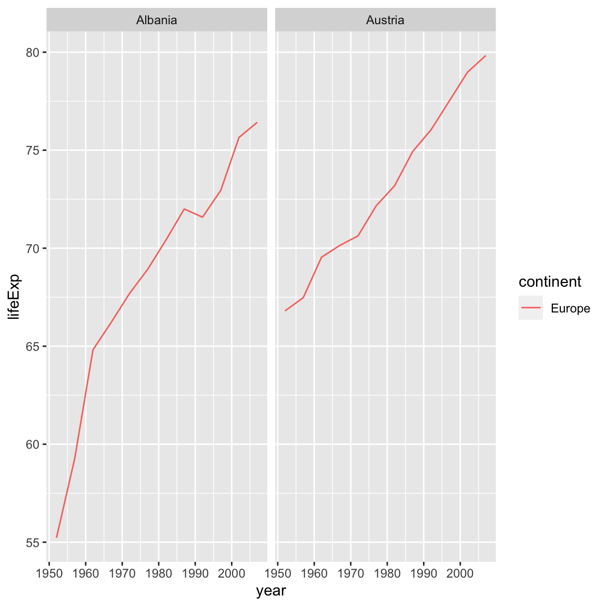

# Manipulating Data Frames with dplyr


At this point, you've seen it all: in the last lesson, we toured all the basic data types and data structures in R. Everything you do will be a manipulation of those tools. But most of the time, the star of the show is the data frame—the table that we created by loading information from a csv file. In this lesson, we'll learn a few more things about working with data frames including how you might summarize a dataframe by a grouping variable, including only certain observations in your summary.  We will do this with the popular package `dplyr`.


```r
library(readr)
cats <- read_csv("data/feline-data.csv")
```

```
Rows: 3 Columns: 3
── Column specification ────────────────────────────────────────────────────────
Delimiter: ","
chr (1): coat
dbl (2): weight, likes_string

ℹ Use `spec()` to retrieve the full column specification for this data.
ℹ Specify the column types or set `show_col_types = FALSE` to quiet this message.
```

We can find the size and various other attributes of our data with a few handy functions:


```r
nrow(cats)
```

```
[1] 3
```

```r
ncol(cats)
```

```
[1] 3
```

```r
dim(cats)
```

```
[1] 3 3
```


```r
names(cats)
```

```
[1] "coat"         "weight"       "likes_string"
```

```r
str(cats)
```

```
spc_tbl_ [3 × 3] (S3: spec_tbl_df/tbl_df/tbl/data.frame)
 $ coat        : chr [1:3] "calico" "black" "tabby"
 $ weight      : num [1:3] 2.1 5 3.2
 $ likes_string: num [1:3] 1 0 1
 - attr(*, "spec")=
  .. cols(
  ..   coat = col_character(),
  ..   weight = col_double(),
  ..   likes_string = col_double()
  .. )
 - attr(*, "problems")=<externalptr> 
```

A way to get a nice overall view of a data frame is to use the `summary` function. This function can be used on various objects in R. For data frames, `summary` yields a numeric, tabular, or descriptive summary of each column. Factor columns are summarized by the number of items in each level, numeric or integer columns by the descriptive statistics (quartiles and mean), and character columns by its length, class, and mode.  


```r
summary(cats)
```

```
     coat               weight       likes_string   
 Length:3           Min.   :2.100   Min.   :0.0000  
 Class :character   1st Qu.:2.650   1st Qu.:0.5000  
 Mode  :character   Median :3.200   Median :1.0000  
                    Mean   :3.433   Mean   :0.6667  
                    3rd Qu.:4.100   3rd Qu.:1.0000  
                    Max.   :5.000   Max.   :1.0000  
```

A really nice feature of RStudio is that it allows us to view our data in a 
very readable and familiar way. Go ahead and click on the name of the `cats`
data frame in the environment pane.

Note that this is a read-only view, it's not editable (which is a good thing!)

## Introducing the Gapminder data

So far, you have seen the basics of manipulating data frames with our cat data;
now let's use those skills to digest a more realistic dataset. Let's read in the
`gapminder` dataset that we downloaded previously and assign it to a data frame called `gapminder`:


```r
gapminder <- read_csv("data/gapminder_data.csv")
```

```
Rows: 1704 Columns: 6
── Column specification ────────────────────────────────────────────────────────
Delimiter: ","
chr (2): country, continent
dbl (4): year, pop, lifeExp, gdpPercap

ℹ Use `spec()` to retrieve the full column specification for this data.
ℹ Specify the column types or set `show_col_types = FALSE` to quiet this message.
```


### Challenge 1 (5 minutes)
>
> How many rows and columns does `gapminder` have?
>
> What kind of data is in the `pop` and `continent` columns?
>
> <details>
> 
> <summary>
> Solution to challenge 1
> </summary>
> 
> <br />
> 
> 
> ```r
> dim(gapminder)
> ```
> 
> ```
> [1] 1704    6
> ```
> 
> ```r
> nrow(gapminder)
> ```
> 
> ```
> [1] 1704
> ```
> 
> ```r
> ncol(gapminder)
> ```
> 
> ```
> [1] 6
> ```
> 
> ```r
> str(gapminder)
> ```
> 
> ```
> spc_tbl_ [1,704 × 6] (S3: spec_tbl_df/tbl_df/tbl/data.frame)
>  $ country  : chr [1:1704] "Afghanistan" "Afghanistan" "Afghanistan" "Afghanistan" ...
>  $ year     : num [1:1704] 1952 1957 1962 1967 1972 ...
>  $ pop      : num [1:1704] 8425333 9240934 10267083 11537966 13079460 ...
>  $ continent: chr [1:1704] "Asia" "Asia" "Asia" "Asia" ...
>  $ lifeExp  : num [1:1704] 28.8 30.3 32 34 36.1 ...
>  $ gdpPercap: num [1:1704] 779 821 853 836 740 ...
>  - attr(*, "spec")=
>   .. cols(
>   ..   country = col_character(),
>   ..   year = col_double(),
>   ..   pop = col_double(),
>   ..   continent = col_character(),
>   ..   lifeExp = col_double(),
>   ..   gdpPercap = col_double()
>   .. )
>  - attr(*, "problems")=<externalptr> 
> ```
> 
> ```r
> summary(gapminder)
> ```
> 
> ```
>    country               year           pop             continent        
>  Length:1704        Min.   :1952   Min.   :6.001e+04   Length:1704       
>  Class :character   1st Qu.:1966   1st Qu.:2.794e+06   Class :character  
>  Mode  :character   Median :1980   Median :7.024e+06   Mode  :character  
>                     Mean   :1980   Mean   :2.960e+07                     
>                     3rd Qu.:1993   3rd Qu.:1.959e+07                     
>                     Max.   :2007   Max.   :1.319e+09                     
>     lifeExp        gdpPercap       
>  Min.   :23.60   Min.   :   241.2  
>  1st Qu.:48.20   1st Qu.:  1202.1  
>  Median :60.71   Median :  3531.8  
>  Mean   :59.47   Mean   :  7215.3  
>  3rd Qu.:70.85   3rd Qu.:  9325.5  
>  Max.   :82.60   Max.   :113523.1  
> ```
> </details>

The first thing we should always do is check out what the data looks like with
`str()` or `summary()`:


```r
str(gapminder)
```

```
spc_tbl_ [1,704 × 6] (S3: spec_tbl_df/tbl_df/tbl/data.frame)
 $ country  : chr [1:1704] "Afghanistan" "Afghanistan" "Afghanistan" "Afghanistan" ...
 $ year     : num [1:1704] 1952 1957 1962 1967 1972 ...
 $ pop      : num [1:1704] 8425333 9240934 10267083 11537966 13079460 ...
 $ continent: chr [1:1704] "Asia" "Asia" "Asia" "Asia" ...
 $ lifeExp  : num [1:1704] 28.8 30.3 32 34 36.1 ...
 $ gdpPercap: num [1:1704] 779 821 853 836 740 ...
 - attr(*, "spec")=
  .. cols(
  ..   country = col_character(),
  ..   year = col_double(),
  ..   pop = col_double(),
  ..   continent = col_character(),
  ..   lifeExp = col_double(),
  ..   gdpPercap = col_double()
  .. )
 - attr(*, "problems")=<externalptr> 
```


```r
summary(gapminder$country)
```

```
   Length     Class      Mode 
     1704 character character 
```

::: {.rmdtip}

**Miscellaneous Tips**

* Files can also be downloaded directly from the Internet into a local
folder of your choice onto your computer using the `download.file` function.
The `read_csv` function can then be executed to read the downloaded file from the download location, for example,

```r
download.file("https://raw.githubusercontent.com/swcarpentry/r-novice-gapminder/gh-pages/_episodes_rmd/data/gapminder_data.csv", destfile = "data/gapminder_data.csv")
gapminder <- read_csv("data/gapminder_data.csv")
```

* Alternatively, you can also read in files directly into R from the Internet by replacing the file paths with a web address in `read_csv`. One should note that in doing this no local copy of the csv file is first saved onto your computer. For example,

```r
gapminder <- read_csv("https://raw.githubusercontent.com/swcarpentry/r-novice-gapminder/gh-pages/_episodes_rmd/data/gapminder_data.csv")
```

* You can read directly from excel spreadsheets without
converting them to plain text first by using the [readxl](https://cran.r-project.org/package=readxl) package.

:::


We'll also likely want to know what the titles of all the columns are, so we can
ask for them:


```r
names(gapminder)
```

```
[1] "country"   "year"      "pop"       "continent" "lifeExp"   "gdpPercap"
```

At this stage, it's important to ask ourselves if the structure R is reporting
matches our intuition or expectations; do the basic data types reported for each
column make sense? If not, we need to sort any problems out now before they turn
into bad surprises down the road, using what we've learned about how R
interprets data, and the importance of *strict consistency* in how we record our
data.

Once we're happy that the data types and structures seem reasonable, it's time
to start digging into our data proper. Check out the first few lines:


```r
head(gapminder)
```

```
# A tibble: 6 × 6
  country      year      pop continent lifeExp gdpPercap
  <chr>       <dbl>    <dbl> <chr>       <dbl>     <dbl>
1 Afghanistan  1952  8425333 Asia         28.8      779.
2 Afghanistan  1957  9240934 Asia         30.3      821.
3 Afghanistan  1962 10267083 Asia         32.0      853.
4 Afghanistan  1967 11537966 Asia         34.0      836.
5 Afghanistan  1972 13079460 Asia         36.1      740.
6 Afghanistan  1977 14880372 Asia         38.4      786.
```

Another very helpful function for looking at your data is the `unique`()
function, to see the unique values in a particular column:


```r
unique(gapminder$continent)
```

```
[1] "Asia"     "Europe"   "Africa"   "Americas" "Oceania" 
```

Manipulation of dataframes means many things to many researchers, we often
select certain observations (rows) or variables (columns), we often group the
data by a certain variable(s), or we even calculate summary statistics. We can
do these types of operations using the normal base R operations:


```r
mean(gapminder$gdpPercap)
```

```
[1] 7215.327
```

The question here is how might you summarize and 
split by some group you might be interested in.

## The `dplyr` package

Luckily, the [`dplyr`](https://cran.r-project.org/package=dplyr)
package provides a number of very useful functions for manipulating dataframes
in a way that will reduce repetition, reduce the probability of making
errors, and probably even save you some typing. As an added bonus, you might
even find the `dplyr` grammar easier to read.

Here we're going to cover 5 of the most commonly used functions as well as using
pipes (`%>%`) to combine them.

1. `select()`
2. `filter()`
3. `group_by()`
4. `summarize()`
5. `mutate()`

If you have have not installed this package earlier, please do so:


```r
install.packages('dplyr')
```

Now let's load the package:


```r
library("dplyr")
```

## Using select()

If, for example, we wanted to move forward with only a few of the variables in
our dataframe we could use the `select()` function. This will keep only the
variables you select.


```r
year_country_gdp <- select(gapminder, year, country, gdpPercap)
```

{width=100%}

## Using filter()

To select on some subset of rows:

```r
filter(gapminder, continent == "Europe")
```

```
# A tibble: 360 × 6
   country  year     pop continent lifeExp gdpPercap
   <chr>   <dbl>   <dbl> <chr>       <dbl>     <dbl>
 1 Albania  1952 1282697 Europe       55.2     1601.
 2 Albania  1957 1476505 Europe       59.3     1942.
 3 Albania  1962 1728137 Europe       64.8     2313.
 4 Albania  1967 1984060 Europe       66.2     2760.
 5 Albania  1972 2263554 Europe       67.7     3313.
 6 Albania  1977 2509048 Europe       68.9     3533.
 7 Albania  1982 2780097 Europe       70.4     3631.
 8 Albania  1987 3075321 Europe       72       3739.
 9 Albania  1992 3326498 Europe       71.6     2497.
10 Albania  1997 3428038 Europe       73.0     3193.
# … with 350 more rows
```

Or select another subset of rows:


```r
filter(gapminder, pop > 1000000)
```

```
# A tibble: 1,524 × 6
   country      year      pop continent lifeExp gdpPercap
   <chr>       <dbl>    <dbl> <chr>       <dbl>     <dbl>
 1 Afghanistan  1952  8425333 Asia         28.8      779.
 2 Afghanistan  1957  9240934 Asia         30.3      821.
 3 Afghanistan  1962 10267083 Asia         32.0      853.
 4 Afghanistan  1967 11537966 Asia         34.0      836.
 5 Afghanistan  1972 13079460 Asia         36.1      740.
 6 Afghanistan  1977 14880372 Asia         38.4      786.
 7 Afghanistan  1982 12881816 Asia         39.9      978.
 8 Afghanistan  1987 13867957 Asia         40.8      852.
 9 Afghanistan  1992 16317921 Asia         41.7      649.
10 Afghanistan  1997 22227415 Asia         41.8      635.
# … with 1,514 more rows
```


Above we used 'normal' grammar, but the strengths of `dplyr` lie in combining 
several functions using pipes. This 
[description](https://twitter.com/WeAreRLadies/status/1172576445794803713) is very useful:


```r
I woke up %>% 
  showered %>% 
  dressed %>% 
  had coffee %>% 
  came to an R workshop
```

Since the pipes grammar is unlike anything we've seen in R before, 
let's repeat what we've done above using pipes.


```r
year_country_gdp <- gapminder %>% 
  select(year, country, gdpPercap)
```

To help you understand why we wrote that in that way, let's walk through it step
by step. First we summon the gapminder dataframe and pass it on, using the pipe
symbol `%>%`, to the next step, which is the `select()` function. In this case
we don't specify which data object we use in the `select()` function since in
gets that from the previous pipe. **Fun Fact**: There is a good chance you have
encountered pipes before in the shell. In R, a pipe symbol is `%>%` while in the
shell it is `|` but the concept is the same! 

## Using filter() with pipes

If we now wanted to move forward with the above, but only with European
countries, we can combine `select` and `filter`


```r
year_country_gdp_euro <- gapminder %>%
    filter(continent == "Europe") %>%
    select(year, country, gdpPercap)
```

### Challenge 1 (10 minutes)
> Write a single command (which can span multiple lines and includes pipes) that
> will produce a dataframe that has the African values for `lifeExp`, `country`
> and `year`, but not for other Continents.  How many rows does your dataframe
> have and why?
>
> <details>
> 
> <summary>
> Solution to challenge 1
> </summary>
> 
> <br />
> 
> ```r
> year_country_lifeExp_Africa <- gapminder %>%
>                            filter(continent == "Africa") %>%
>                            select(year, country, lifeExp)
> ```
> </details>


As with last time, first we pass the gapminder dataframe to the `filter()`
function, then we pass the filtered version of the gapminder dataframe to the
`select()` function. **Note:** The order of operations is very important in this
case. If we used 'select' first, filter would not be able to find the variable
continent since we would have removed it in the previous step.

## Using group_by() and summarize()

Now, we were supposed to be reducing the error prone repetitiveness of what can
be done with base R, but up to now we haven't done that since we would have to
repeat the above for each continent. Instead of `filter()`, which will only pass
observations that meet your criteria (in the above: `continent=="Europe"`), we
can use `group_by()`, which will essentially use every unique criteria that you
could have used in filter.


```r
gapminder
```

```
# A tibble: 1,704 × 6
   country      year      pop continent lifeExp gdpPercap
   <chr>       <dbl>    <dbl> <chr>       <dbl>     <dbl>
 1 Afghanistan  1952  8425333 Asia         28.8      779.
 2 Afghanistan  1957  9240934 Asia         30.3      821.
 3 Afghanistan  1962 10267083 Asia         32.0      853.
 4 Afghanistan  1967 11537966 Asia         34.0      836.
 5 Afghanistan  1972 13079460 Asia         36.1      740.
 6 Afghanistan  1977 14880372 Asia         38.4      786.
 7 Afghanistan  1982 12881816 Asia         39.9      978.
 8 Afghanistan  1987 13867957 Asia         40.8      852.
 9 Afghanistan  1992 16317921 Asia         41.7      649.
10 Afghanistan  1997 22227415 Asia         41.8      635.
# … with 1,694 more rows
```

```r
gapminder %>% group_by(continent)
```

```
# A tibble: 1,704 × 6
# Groups:   continent [5]
   country      year      pop continent lifeExp gdpPercap
   <chr>       <dbl>    <dbl> <chr>       <dbl>     <dbl>
 1 Afghanistan  1952  8425333 Asia         28.8      779.
 2 Afghanistan  1957  9240934 Asia         30.3      821.
 3 Afghanistan  1962 10267083 Asia         32.0      853.
 4 Afghanistan  1967 11537966 Asia         34.0      836.
 5 Afghanistan  1972 13079460 Asia         36.1      740.
 6 Afghanistan  1977 14880372 Asia         38.4      786.
 7 Afghanistan  1982 12881816 Asia         39.9      978.
 8 Afghanistan  1987 13867957 Asia         40.8      852.
 9 Afghanistan  1992 16317921 Asia         41.7      649.
10 Afghanistan  1997 22227415 Asia         41.8      635.
# … with 1,694 more rows
```
You will notice that the structure of the dataframe where we used `group_by()`
(`grouped_df`) is not the same as the original `gapminder` (`data.frame`). A
`grouped_df` can be thought of as a `list` where each item in the `list` is a
`data.frame` which contains only the rows that correspond to the a particular
value `continent` (at least in the example above).

{width=100%}

## Using summarize()

The above was a bit on the uneventful side but `group_by()` is much more
exciting in conjunction with `summarize()`. This will allow us to create new
variable(s) by using functions that repeat for each of the continent-specific
data frames. That is to say, using the `group_by()` function, we split our
original dataframe into multiple pieces, then we can run functions
(e.g. `mean()` or `sd()`) within `summarize()`.


```r
gdp_bycontinents <- gapminder %>%
    group_by(continent) %>%
    summarize(mean_gdpPercap = mean(gdpPercap))
```

{width=100%}


```
# A tibble: 5 × 2
  continent mean_gdpPercap
  <chr>              <dbl>
1 Africa             2194.
2 Americas           7136.
3 Asia               7902.
4 Europe            14469.
5 Oceania           18622.
```

That allowed us to calculate the mean gdpPercap for each continent, but it gets
even better.

### Challenge 2 (10 minutes)
> Calculate the average life expectancy per country. Which has the longest average life
> expectancy and which has the shortest average life expectancy?
>
> <details>
> 
> <summary>
> Solution to challenge 2
> </summary>
> 
> <br />
>
>```r
>lifeExp_bycountry <- gapminder %>%
>    group_by(country) %>%
>    summarize(mean_lifeExp = mean(lifeExp))
>lifeExp_bycountry %>%
>    filter(mean_lifeExp == min(mean_lifeExp) | mean_lifeExp == max(mean_lifeExp))
>```
>
>```
># A tibble: 2 × 2
>  country      mean_lifeExp
>  <chr>               <dbl>
>1 Iceland              76.5
>2 Sierra Leone         36.8
>```
Another way to do this is to use the `dplyr` function `arrange()`, which
arranges the rows in a data frame according to the order of one or more
variables from the data frame.  It has similar syntax to other functions from
the `dplyr` package. You can use `desc()` inside `arrange()` to sort in
descending order.
>
>```r
>lifeExp_bycountry %>%
>    arrange(mean_lifeExp) %>%
>    head(1)
>```
>
>```
># A tibble: 1 × 2
>  country      mean_lifeExp
>  <chr>               <dbl>
>1 Sierra Leone         36.8
>```
>
>```r
>lifeExp_bycountry %>%
>    arrange(desc(mean_lifeExp)) %>%
>    head(1)
>```
>
>```
># A tibble: 1 × 2
>  country mean_lifeExp
>  <chr>          <dbl>
>1 Iceland         76.5
>```
> </details>


The function `group_by()` allows us to group by multiple variables. Let's group by `year` and `continent`.


```r
gdp_bycontinents_byyear <- gapminder %>%
    group_by(continent, year) %>%
    summarize(mean_gdpPercap = mean(gdpPercap))
```

```
`summarise()` has grouped output by 'continent'. You can override using the
`.groups` argument.
```

That is already quite powerful, but it gets even better! You're not limited to defining 1 new variable in `summarize()`.


```r
gdp_pop_bycontinents_byyear <- gapminder %>%
    group_by(continent, year) %>%
    summarize(mean_gdpPercap = mean(gdpPercap),
              sd_gdpPercap = sd(gdpPercap),
              mean_pop = mean(pop),
              sd_pop = sd(pop))
```

```
`summarise()` has grouped output by 'continent'. You can override using the
`.groups` argument.
```

## Using count()

A very common operation is to count the number of observations for each
group. The `dplyr` package comes with a function that helps with this.

For instance, if we wanted to check the number of countries included in the
dataset for the year 2002, we can use the `count()` function. It takes the name
of one or more columns that contain the groups we are interested in, and we can
optionally sort the results in descending order by adding `sort=TRUE`:


```r
gapminder %>%
    filter(year == 2002) %>%
    count(continent, sort = TRUE)
```

```
# A tibble: 5 × 2
  continent     n
  <chr>     <int>
1 Africa       52
2 Asia         33
3 Europe       30
4 Americas     25
5 Oceania       2
```


## Using mutate()

We can also create new variables prior to (or even after) summarizing information using `mutate()`.


```r
gdp_pop_bycontinents_byyear <- gapminder %>%
    mutate(gdp_billion = gdpPercap*pop/10^9) %>%
    group_by(continent,year) %>%
    summarize(mean_gdpPercap = mean(gdpPercap),
              sd_gdpPercap = sd(gdpPercap),
              mean_pop = mean(pop),
              sd_pop = sd(pop),
              mean_gdp_billion = mean(gdp_billion),
              sd_gdp_billion = sd(gdp_billion))
```

```
`summarise()` has grouped output by 'continent'. You can override using the
`.groups` argument.
```

### Challenge 3 (10 minutes)
> Calculate the total GDP per contintent and year. Which continent, and in what year,
> had the highest total GDP?
>
> <details>
> 
> <summary>
> Solution to challenge 3
> </summary>
> 
> <br />
>
>```r
> gdp_by_continent_by_year <- gapminder %>% 
>     mutate(gdp = gdpPercap * pop) %>%
>     group_by(continent, year) %>%
>     summarise(total_gdp = sum(gdp)) %>% 
>     arrange(desc(total_gdp))
>```
>
>```
>`summarise()` has grouped output by 'continent'. You can override using the
>`.groups` argument.
>```
> </details>

## Connect mutate with logical groupings: ifelse

When creating new variables, we can hook this with a logical condition. A simple combination of
`mutate()` and `ifelse()` facilitates filtering right where it is needed: in the moment of creating something new.
This easy-to-read statement is a fast and powerful way of discarding certain data (even though the overall dimension
of the data frame will not change) or for updating values depending on this given condition.


```r
## keeping all data but "filtering" after a certain condition
# calculate GDP only for people with a life expectation above 25
gdp_pop_bycontinents_byyear_above25 <- gapminder %>%
    mutate(gdp_billion = ifelse(lifeExp > 25, gdpPercap * pop / 10^9, NA)) %>%
    group_by(continent, year) %>%
    summarize(mean_gdpPercap = mean(gdpPercap),
              sd_gdpPercap = sd(gdpPercap),
              mean_pop = mean(pop),
              sd_pop = sd(pop),
              mean_gdp_billion = mean(gdp_billion),
              sd_gdp_billion = sd(gdp_billion))
```

```
`summarise()` has grouped output by 'continent'. You can override using the
`.groups` argument.
```

```r
## updating only if certain condition is fullfilled
# for life expectations above 40 years, the gpd to be expected in the future is scaled
gdp_future_bycontinents_byyear_high_lifeExp <- gapminder %>%
    mutate(gdp_futureExpectation = ifelse(lifeExp > 40, gdpPercap * 1.5, gdpPercap)) %>%
    group_by(continent, year) %>%
    summarize(mean_gdpPercap = mean(gdpPercap),
              mean_gdpPercap_expected = mean(gdp_futureExpectation))
```

```
`summarise()` has grouped output by 'continent'. You can override using the
`.groups` argument.
```

## Combining `dplyr` and `ggplot2`

First install and load ggplot2:


```r
install.packages('ggplot2')
```


```r
library("ggplot2")
```

In the plotting lesson we looked at how to make a multi-panel figure by adding
a layer of facet panels using `ggplot2`. 


```r
# Filter countries that start with "A"
a_countries <- gapminder %>% 
  filter(country %in% c("Afghanistan", "Albania", "Algeria", "Angola", "Argentina", "Australia", "Austria"))

# Make the plot
ggplot(data = a_countries, aes(x = year, y = lifeExp, color = continent)) +
  geom_line() + 
  facet_wrap(vars(country))
```


This code makes the right plot but it also provides a way to chain operations. Just as we used
`%>%` to pipe data along a chain of `dplyr` functions we can use it to pass data
to `ggplot()`. Because `%>%` replaces the first argument in a function we don't
need to specify the `data =` argument in the `ggplot()` function. By combining
`dplyr` and `ggplot2` functions we can alter this figure for only those continents in Europe.


```r
gapminder %>%
  filter(country %in% c("Afghanistan", "Albania", "Algeria", "Angola", "Argentina", "Australia", "Austria")) %>% 
  filter(continent == "Europe") %>% 
  ggplot(aes(x = year, y = lifeExp, color = continent)) +
  geom_line() +
  facet_wrap(vars(country))
```



Using `dplyr` functions also helps us do calculations on the fly, for example if we were interested in 
converting `lifeExp` which is in years to days:


```r
gapminder %>%
  filter(country %in% c("Afghanistan", "Albania", "Algeria", "Angola", "Argentina", "Australia", "Austria")) %>% 
  filter(continent == "Europe") %>% 
  mutate(num_days = lifeExp*365) %>% 
  ggplot(aes(x = year, y = num_days, color = continent)) +
  geom_line() +
  facet_wrap(vars(country))
```


### Advanced Challenge

> Calculate the average life expectancy in 2002 of 2 randomly selected countries
> for each continent. Then arrange the continent names in reverse order.
> **Hint:** Use the `dplyr` functions `arrange()` and `sample_n()`, they have
> similar syntax to other dplyr functions.
> 
> <details>
> 
> <summary>
> Solution to challenge
> </summary>
> 
> <br />
>
>```r
>lifeExp_2countries_bycontinents <- gapminder %>%
>    filter(year==2002) %>%
>    group_by(continent) %>%
>    sample_n(2) %>%
>    summarize(mean_lifeExp=mean(lifeExp)) %>%
>    arrange(desc(mean_lifeExp))
>```
> </details>


## Other great resources

* [R for Data Science](http://r4ds.had.co.nz/)
* [Data Wrangling Cheat sheet](https://www.rstudio.com/wp-content/uploads/2015/02/data-wrangling-cheatsheet.pdf)
* [Introduction to dplyr](https://dplyr.tidyverse.org/)
* [Data wrangling with R and RStudio](https://www.rstudio.com/resources/webinars/data-wrangling-with-r-and-rstudio/)
