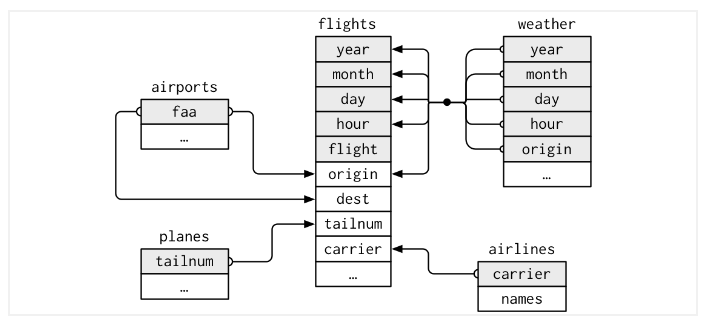

# Joining Related Data


## Introducing Relational Data
In real life, we often have two or more related datasets that share a set of common columns.   We would like to combine these two datasets based on their common columns, known as **key** or **key variables**.

We may want to change a dataset by adding information from a second dataset.
For example, say we have a dataset containing employee information such as employee ID, 
name, job position, hire date, etc., and a second dataset containing the
current and historical wages for each job position. A relevant join -- adding a 
column of data for each row -- may be merging the current wage for each employee 
into the employee dataset.

We may also want to choose only a portion of a dataset. For example, say we have a dataset including all students who ever attended a school along with their student ID, years attended, grades for each class, graduation date (if applicable), and so on, and a second dataset which is simply a list of current students. A relevant join
-- retaining all columns of data, but for only specific rows -- may be a reduction 
of the first dataset for only those students currently in attendance, but with all 
their information (e.g., grades, etc.).

The first example is that of a **mutating join** - where we change one table 
by adding in data from a second table, based on matching through a key variable 
that exists in both tables. The second example is that of a **filtering join** - 
where we subset one table based on data in a second table, again based on matching 
through a key variable.

## Types of joins with dplyr

The `dplyr` package has several functions that allow us to make these joins. 
Assume we have tables _x_ and _y_.

There are four types of **mutating joins**, which add new variables to one 
table from matching rows in another:

* **inner joins** include all rows in x AND y

* **left joins** include all rows in x *plus* matching rows from y

* **full joins** include all rows in x OR y

* **right joins** include all rows in y *plus* matching rows from x

Note that left, full and right joins are also called _outer joins_.

There are two types of **filtering joins**, which filter observations from one 
table based on whether or not they match an observation in the other table:

* **semi joins** return all rows in x that HAVE a match in y

* **anti joins** return all rows in x that do NOT HAVE a match in y

The syntax for dplyr joins is simple: `xxx_join(x, y, by = "key_variable")`.

## Introducing the nycflights13 data

In prior lessons, you have seen datasets such as the gapminder and cat data. 
Now let's use a different dataset, from the `nycflights13` package^[Wickham H (2022). nycflights13: Flights that Departed NYC in 2013. R package version 1.0.2, https://github.com/hadley/nycflights13.], 
to explore relational data.

This package contains information about all flights that departed from 
New York City (e.g., EWR, JFK and LGA) to destinations in 2013. To help 
understand what causes delays, it also includes a number of other useful datasets:

* weather: hourly meteorological data for each airport
* planes: construction information about each plane
* airports: airport names and locations
* airlines: translation between two letter carrier codes and names

This diagram shows the relationships among the five datasets: 



The key **variables** between flights and the *other datasets* are:

* flights dataset <- **origin** and **dest** both = **faa** -> *airports* dataset
* flights dataset <- **tailnum** -> *planes* dataset
* flights dataset <- **origin**, **year**, **month**, **day**, and **hour** -> *weather* dataset
* flights dataset <- **carrier** -> *airlines* dataset

## Getting started

First, install the packages if you haven't already done so (you probably
installed dplyr in a previous lesson):


```r
install.packages("dplyr")
install.packages("nycflights13")
```

Then, load the packages:


```r
library(dplyr)
library(nycflights13)
```

Let's take a peek at the main `nycflights13` dataset, "flights":


```r
flights
```

```
# A tibble: 336,776 × 19
    year month   day dep_time sched_de…¹ dep_d…² arr_t…³ sched…⁴ arr_d…⁵ carrier
   <int> <int> <int>    <int>      <int>   <dbl>   <int>   <int>   <dbl> <chr>  
 1  2013     1     1      517        515       2     830     819      11 UA     
 2  2013     1     1      533        529       4     850     830      20 UA     
 3  2013     1     1      542        540       2     923     850      33 AA     
 4  2013     1     1      544        545      -1    1004    1022     -18 B6     
 5  2013     1     1      554        600      -6     812     837     -25 DL     
 6  2013     1     1      554        558      -4     740     728      12 UA     
 7  2013     1     1      555        600      -5     913     854      19 B6     
 8  2013     1     1      557        600      -3     709     723     -14 EV     
 9  2013     1     1      557        600      -3     838     846      -8 B6     
10  2013     1     1      558        600      -2     753     745       8 AA     
# … with 336,766 more rows, 9 more variables: flight <int>, tailnum <chr>,
#   origin <chr>, dest <chr>, air_time <dbl>, distance <dbl>, hour <dbl>,
#   minute <dbl>, time_hour <dttm>, and abbreviated variable names
#   ¹​sched_dep_time, ²​dep_delay, ³​arr_time, ⁴​sched_arr_time, ⁵​arr_delay
```

And get some more information about the flights dataset:


```r
?flights
```

This tells us that the airline name, as opposed to a two-letter carrier abbreviation,
can be found in the `airlines` dataset, and that the `airports` dataset gives
more information on the flight destinations.

First, we will drop some variables from flights to make our work more evident.


```r
flights_mini <- flights %>% select(year:day, dep_delay, carrier:dest)
flights_mini
```

```
# A tibble: 336,776 × 9
    year month   day dep_delay carrier flight tailnum origin dest 
   <int> <int> <int>     <dbl> <chr>    <int> <chr>   <chr>  <chr>
 1  2013     1     1         2 UA        1545 N14228  EWR    IAH  
 2  2013     1     1         4 UA        1714 N24211  LGA    IAH  
 3  2013     1     1         2 AA        1141 N619AA  JFK    MIA  
 4  2013     1     1        -1 B6         725 N804JB  JFK    BQN  
 5  2013     1     1        -6 DL         461 N668DN  LGA    ATL  
 6  2013     1     1        -4 UA        1696 N39463  EWR    ORD  
 7  2013     1     1        -5 B6         507 N516JB  EWR    FLL  
 8  2013     1     1        -3 EV        5708 N829AS  LGA    IAD  
 9  2013     1     1        -3 B6          79 N593JB  JFK    MCO  
10  2013     1     1        -2 AA         301 N3ALAA  LGA    ORD  
# … with 336,766 more rows
```

### Data analysis questions

How would we answer the following questions:

* what is the total number of flights per airline, but with 
the airline name showing instead of the carrier abbreviation?

* how many flights occurred when the temperature fell below freezing?

* are older planes more likely to have a delayed arrival?

Answering questions such as these requires us to join datasets.

## Using **left_join()**

The syntax for dplyr joins is: `xxx_join(x, y, by = "key_variable")`.

To answer the first question (i.e., number of flights per airline), we need
to join the flights and airlines datasets. We want a **left join** because we
want to add the airline names from airlines (as our second table) to flights 
(our first table). From above, we know that the flights dataset has a variable 
called 'carrier', and that that same variable is in the airlines dataset -- this
is our key (or "by" variable).


```r
left_join(x = flights_mini, y = airlines, by = "carrier")
```

```
# A tibble: 336,776 × 10
    year month   day dep_delay carrier flight tailnum origin dest  name         
   <int> <int> <int>     <dbl> <chr>    <int> <chr>   <chr>  <chr> <chr>        
 1  2013     1     1         2 UA        1545 N14228  EWR    IAH   United Air L…
 2  2013     1     1         4 UA        1714 N24211  LGA    IAH   United Air L…
 3  2013     1     1         2 AA        1141 N619AA  JFK    MIA   American Air…
 4  2013     1     1        -1 B6         725 N804JB  JFK    BQN   JetBlue Airw…
 5  2013     1     1        -6 DL         461 N668DN  LGA    ATL   Delta Air Li…
 6  2013     1     1        -4 UA        1696 N39463  EWR    ORD   United Air L…
 7  2013     1     1        -5 B6         507 N516JB  EWR    FLL   JetBlue Airw…
 8  2013     1     1        -3 EV        5708 N829AS  LGA    IAD   ExpressJet A…
 9  2013     1     1        -3 B6          79 N593JB  JFK    MCO   JetBlue Airw…
10  2013     1     1        -2 AA         301 N3ALAA  LGA    ORD   American Air…
# … with 336,766 more rows
```

We can see that the number of rows has stayed the same: 366,776, but that we 
have one new column (at the end) called "name".

Note that we could have instead used the pipe operator after summoning 'flights_mini'.


```r
flights_mini %>% left_join(y = airlines, by = "carrier")
```

```
# A tibble: 336,776 × 10
    year month   day dep_delay carrier flight tailnum origin dest  name         
   <int> <int> <int>     <dbl> <chr>    <int> <chr>   <chr>  <chr> <chr>        
 1  2013     1     1         2 UA        1545 N14228  EWR    IAH   United Air L…
 2  2013     1     1         4 UA        1714 N24211  LGA    IAH   United Air L…
 3  2013     1     1         2 AA        1141 N619AA  JFK    MIA   American Air…
 4  2013     1     1        -1 B6         725 N804JB  JFK    BQN   JetBlue Airw…
 5  2013     1     1        -6 DL         461 N668DN  LGA    ATL   Delta Air Li…
 6  2013     1     1        -4 UA        1696 N39463  EWR    ORD   United Air L…
 7  2013     1     1        -5 B6         507 N516JB  EWR    FLL   JetBlue Airw…
 8  2013     1     1        -3 EV        5708 N829AS  LGA    IAD   ExpressJet A…
 9  2013     1     1        -3 B6          79 N593JB  JFK    MCO   JetBlue Airw…
10  2013     1     1        -2 AA         301 N3ALAA  LGA    ORD   American Air…
# … with 336,766 more rows
```

Now, let's wrangle to get the total counts, by grouping by either carrier or the 
new "name" variable brought in from the airlines dataset. Note that we can also 
drop the argument names (e.g., no "y" in "y = airlines"). I tend to keep the 
"by" argument name in to keep my code a bit more clear.


```r
flights_mini %>%
  left_join(airlines, by = "carrier") %>%
  group_by(name) %>%
  summarize(total_flights = n())
```

```
# A tibble: 16 × 2
   name                        total_flights
   <chr>                               <int>
 1 AirTran Airways Corporation          3260
 2 Alaska Airlines Inc.                  714
 3 American Airlines Inc.              32729
 4 Delta Air Lines Inc.                48110
 5 Endeavor Air Inc.                   18460
 6 Envoy Air                           26397
 7 ExpressJet Airlines Inc.            54173
 8 Frontier Airlines Inc.                685
 9 Hawaiian Airlines Inc.                342
10 JetBlue Airways                     54635
11 Mesa Airlines Inc.                    601
12 SkyWest Airlines Inc.                  32
13 Southwest Airlines Co.              12275
14 United Air Lines Inc.               58665
15 US Airways Inc.                     20536
16 Virgin America                       5162
```

We can also rename variables within our join call. Let's rename "name" to 
"airline" (and sort descending by number of flights).


```r
flights_mini %>%
  left_join(airlines %>% select(carrier, Airline = name), by = "carrier") %>%
  ## make sure you use the new variable name
  group_by(Airline) %>%
  summarize(`Total Flights` = n()) %>% 
  arrange(desc(`Total Flights`))
```

```
# A tibble: 16 × 2
   Airline                     `Total Flights`
   <chr>                                 <int>
 1 United Air Lines Inc.                 58665
 2 JetBlue Airways                       54635
 3 ExpressJet Airlines Inc.              54173
 4 Delta Air Lines Inc.                  48110
 5 American Airlines Inc.                32729
 6 Envoy Air                             26397
 7 US Airways Inc.                       20536
 8 Endeavor Air Inc.                     18460
 9 Southwest Airlines Co.                12275
10 Virgin America                         5162
11 AirTran Airways Corporation            3260
12 Alaska Airlines Inc.                    714
13 Frontier Airlines Inc.                  685
14 Mesa Airlines Inc.                      601
15 Hawaiian Airlines Inc.                  342
16 SkyWest Airlines Inc.                    32
```

### Challenge 1 (2 minutes)
>
> How would you add each plane's manufacture year (rename it "manufacture_year") 
to the flights dataset?
>
>
> <details>
> 
> <summary>
> Solution to challenge 1
> </summary>
> 
> <br />
>
>```r
> left_join(flights_mini, planes %>% select(tailnum, manufacture_year = year), by = "tailnum")
>```
>
>```
># A tibble: 336,776 × 10
>    year month   day dep_delay carrier flight tailnum origin dest  manufacture…¹
>   <int> <int> <int>     <dbl> <chr>    <int> <chr>   <chr>  <chr>         <int>
> 1  2013     1     1         2 UA        1545 N14228  EWR    IAH            1999
> 2  2013     1     1         4 UA        1714 N24211  LGA    IAH            1998
> 3  2013     1     1         2 AA        1141 N619AA  JFK    MIA            1990
> 4  2013     1     1        -1 B6         725 N804JB  JFK    BQN            2012
> 5  2013     1     1        -6 DL         461 N668DN  LGA    ATL            1991
> 6  2013     1     1        -4 UA        1696 N39463  EWR    ORD            2012
> 7  2013     1     1        -5 B6         507 N516JB  EWR    FLL            2000
> 8  2013     1     1        -3 EV        5708 N829AS  LGA    IAD            1998
> 9  2013     1     1        -3 B6          79 N593JB  JFK    MCO            2004
>10  2013     1     1        -2 AA         301 N3ALAA  LGA    ORD              NA
># … with 336,766 more rows, and abbreviated variable name ¹​manufacture_year
>```
>
>```r
> ## same as this:
> flights_mini %>% 
>   left_join(planes %>% select(tailnum, manufacture_year = year), by = "tailnum")
>```
>
>```
># A tibble: 336,776 × 10
>    year month   day dep_delay carrier flight tailnum origin dest  manufacture…¹
>   <int> <int> <int>     <dbl> <chr>    <int> <chr>   <chr>  <chr>         <int>
> 1  2013     1     1         2 UA        1545 N14228  EWR    IAH            1999
> 2  2013     1     1         4 UA        1714 N24211  LGA    IAH            1998
> 3  2013     1     1         2 AA        1141 N619AA  JFK    MIA            1990
> 4  2013     1     1        -1 B6         725 N804JB  JFK    BQN            2012
> 5  2013     1     1        -6 DL         461 N668DN  LGA    ATL            1991
> 6  2013     1     1        -4 UA        1696 N39463  EWR    ORD            2012
> 7  2013     1     1        -5 B6         507 N516JB  EWR    FLL            2000
> 8  2013     1     1        -3 EV        5708 N829AS  LGA    IAD            1998
> 9  2013     1     1        -3 B6          79 N593JB  JFK    MCO            2004
>10  2013     1     1        -2 AA         301 N3ALAA  LGA    ORD              NA
># … with 336,766 more rows, and abbreviated variable name ¹​manufacture_year
>```
> </details>

One thing we haven't specifically noted is that mutating joins will bring in all
variables from the matching dataset. You'll see from the solution above that we
can change that behaviour by using `select()` and listing only those variables we 
want to join in (don't forget the key variable!).

## Modifying the `by` argument

###  Excluding the `by` argument

We can modify the "by" argument a few ways. See what happens if we don't 
specify a `by` variable.


```r
## joining without specifying a `by` variable
left_join(flights_mini, airlines)
```

```
Joining, by = "carrier"
```

```
# A tibble: 336,776 × 10
    year month   day dep_delay carrier flight tailnum origin dest  name         
   <int> <int> <int>     <dbl> <chr>    <int> <chr>   <chr>  <chr> <chr>        
 1  2013     1     1         2 UA        1545 N14228  EWR    IAH   United Air L…
 2  2013     1     1         4 UA        1714 N24211  LGA    IAH   United Air L…
 3  2013     1     1         2 AA        1141 N619AA  JFK    MIA   American Air…
 4  2013     1     1        -1 B6         725 N804JB  JFK    BQN   JetBlue Airw…
 5  2013     1     1        -6 DL         461 N668DN  LGA    ATL   Delta Air Li…
 6  2013     1     1        -4 UA        1696 N39463  EWR    ORD   United Air L…
 7  2013     1     1        -5 B6         507 N516JB  EWR    FLL   JetBlue Airw…
 8  2013     1     1        -3 EV        5708 N829AS  LGA    IAD   ExpressJet A…
 9  2013     1     1        -3 B6          79 N593JB  JFK    MCO   JetBlue Airw…
10  2013     1     1        -2 AA         301 N3ALAA  LGA    ORD   American Air…
# … with 336,766 more rows
```

R will match by any variable with the same name in both datasets. Be careful - 
this might not be what you want!


```r
left_join(flights_mini, planes)
```

```
Joining, by = c("year", "tailnum")
```

```
# A tibble: 336,776 × 16
    year month   day dep_delay carrier flight tailnum origin dest  type  manuf…¹
   <int> <int> <int>     <dbl> <chr>    <int> <chr>   <chr>  <chr> <chr> <chr>  
 1  2013     1     1         2 UA        1545 N14228  EWR    IAH   <NA>  <NA>   
 2  2013     1     1         4 UA        1714 N24211  LGA    IAH   <NA>  <NA>   
 3  2013     1     1         2 AA        1141 N619AA  JFK    MIA   <NA>  <NA>   
 4  2013     1     1        -1 B6         725 N804JB  JFK    BQN   <NA>  <NA>   
 5  2013     1     1        -6 DL         461 N668DN  LGA    ATL   <NA>  <NA>   
 6  2013     1     1        -4 UA        1696 N39463  EWR    ORD   <NA>  <NA>   
 7  2013     1     1        -5 B6         507 N516JB  EWR    FLL   <NA>  <NA>   
 8  2013     1     1        -3 EV        5708 N829AS  LGA    IAD   <NA>  <NA>   
 9  2013     1     1        -3 B6          79 N593JB  JFK    MCO   <NA>  <NA>   
10  2013     1     1        -2 AA         301 N3ALAA  LGA    ORD   <NA>  <NA>   
# … with 336,766 more rows, 5 more variables: model <chr>, engines <int>,
#   seats <int>, speed <int>, engine <chr>, and abbreviated variable name
#   ¹​manufacturer
```

The variable "year" exists in both flights_mini and planes, but means different 
things. When not specifying the key, R assumed you wanted to join by "year" as
well, which resulted in a lot of NAs!

### Joining on multiple keys

You may have noticed earlier that we can join by more than one variable. To do
so, simply use `c("variable1", "variable2", "etc")` for your keys. Notice that 
year, month, day, and origin are in both the flights_mini and weather datasets.


```r
left_join(flights_mini, weather, by = c("year", "month", "day", "origin"))
```

```
# A tibble: 8,036,575 × 20
    year month   day dep_delay carrier flight tailnum origin dest   hour  temp
   <int> <int> <int>     <dbl> <chr>    <int> <chr>   <chr>  <chr> <int> <dbl>
 1  2013     1     1         2 UA        1545 N14228  EWR    IAH       1  39.0
 2  2013     1     1         2 UA        1545 N14228  EWR    IAH       2  39.0
 3  2013     1     1         2 UA        1545 N14228  EWR    IAH       3  39.0
 4  2013     1     1         2 UA        1545 N14228  EWR    IAH       4  39.9
 5  2013     1     1         2 UA        1545 N14228  EWR    IAH       5  39.0
 6  2013     1     1         2 UA        1545 N14228  EWR    IAH       6  37.9
 7  2013     1     1         2 UA        1545 N14228  EWR    IAH       7  39.0
 8  2013     1     1         2 UA        1545 N14228  EWR    IAH       8  39.9
 9  2013     1     1         2 UA        1545 N14228  EWR    IAH       9  39.9
10  2013     1     1         2 UA        1545 N14228  EWR    IAH      10  41  
# … with 8,036,565 more rows, and 9 more variables: dewp <dbl>, humid <dbl>,
#   wind_dir <dbl>, wind_speed <dbl>, wind_gust <dbl>, precip <dbl>,
#   pressure <dbl>, visib <dbl>, time_hour <dttm>
```

You'll see that we now have over 8 million rows. This is because the "hour" 
variable in weather matched many times for each year X month X day X origin
combination, resulting in repeat of information from flights_mini.

What happens if you didn't know that "year" was in both datasets?


```r
left_join(flights_mini, weather, by = c("month", "day", "origin"))
```

```
# A tibble: 8,036,575 × 21
   year.x month   day dep_delay carrier flight tailnum origin dest  year.y  hour
    <int> <int> <int>     <dbl> <chr>    <int> <chr>   <chr>  <chr>  <int> <int>
 1   2013     1     1         2 UA        1545 N14228  EWR    IAH     2013     1
 2   2013     1     1         2 UA        1545 N14228  EWR    IAH     2013     2
 3   2013     1     1         2 UA        1545 N14228  EWR    IAH     2013     3
 4   2013     1     1         2 UA        1545 N14228  EWR    IAH     2013     4
 5   2013     1     1         2 UA        1545 N14228  EWR    IAH     2013     5
 6   2013     1     1         2 UA        1545 N14228  EWR    IAH     2013     6
 7   2013     1     1         2 UA        1545 N14228  EWR    IAH     2013     7
 8   2013     1     1         2 UA        1545 N14228  EWR    IAH     2013     8
 9   2013     1     1         2 UA        1545 N14228  EWR    IAH     2013     9
10   2013     1     1         2 UA        1545 N14228  EWR    IAH     2013    10
# … with 8,036,565 more rows, and 10 more variables: temp <dbl>, dewp <dbl>,
#   humid <dbl>, wind_dir <dbl>, wind_speed <dbl>, wind_gust <dbl>,
#   precip <dbl>, pressure <dbl>, visib <dbl>, time_hour <dttm>
```

The "year" variable from flights_mini has been renamed "year.x", and "year" 
from "weather" has been renamed "year.y". (Whenever this happens, variables 
ending in ".x" come from the first table, while those ending in ".y" come from
the other table.)

### Key variables with different names

We can also match on a key that has a different name in the related tables 
(although its values are the same). The variable "faa" in airports is equivalent
to flights_mini's "dest" variable. Here are three ways of getting the same result.


```r
## matching key name in the `by`
left_join(flights_mini, airports, by = c("dest" = "faa"))
```

```
# A tibble: 336,776 × 16
    year month   day dep_delay carrier flight tailnum origin dest  name      lat
   <int> <int> <int>     <dbl> <chr>    <int> <chr>   <chr>  <chr> <chr>   <dbl>
 1  2013     1     1         2 UA        1545 N14228  EWR    IAH   George…  30.0
 2  2013     1     1         4 UA        1714 N24211  LGA    IAH   George…  30.0
 3  2013     1     1         2 AA        1141 N619AA  JFK    MIA   Miami …  25.8
 4  2013     1     1        -1 B6         725 N804JB  JFK    BQN   <NA>     NA  
 5  2013     1     1        -6 DL         461 N668DN  LGA    ATL   Hartsf…  33.6
 6  2013     1     1        -4 UA        1696 N39463  EWR    ORD   Chicag…  42.0
 7  2013     1     1        -5 B6         507 N516JB  EWR    FLL   Fort L…  26.1
 8  2013     1     1        -3 EV        5708 N829AS  LGA    IAD   Washin…  38.9
 9  2013     1     1        -3 B6          79 N593JB  JFK    MCO   Orland…  28.4
10  2013     1     1        -2 AA         301 N3ALAA  LGA    ORD   Chicag…  42.0
# … with 336,766 more rows, and 5 more variables: lon <dbl>, alt <dbl>,
#   tz <dbl>, dst <chr>, tzone <chr>
```

```r
## renaming key in a select
left_join(flights_mini, airports %>% rename(dest = faa), by = "dest")
```

```
# A tibble: 336,776 × 16
    year month   day dep_delay carrier flight tailnum origin dest  name      lat
   <int> <int> <int>     <dbl> <chr>    <int> <chr>   <chr>  <chr> <chr>   <dbl>
 1  2013     1     1         2 UA        1545 N14228  EWR    IAH   George…  30.0
 2  2013     1     1         4 UA        1714 N24211  LGA    IAH   George…  30.0
 3  2013     1     1         2 AA        1141 N619AA  JFK    MIA   Miami …  25.8
 4  2013     1     1        -1 B6         725 N804JB  JFK    BQN   <NA>     NA  
 5  2013     1     1        -6 DL         461 N668DN  LGA    ATL   Hartsf…  33.6
 6  2013     1     1        -4 UA        1696 N39463  EWR    ORD   Chicag…  42.0
 7  2013     1     1        -5 B6         507 N516JB  EWR    FLL   Fort L…  26.1
 8  2013     1     1        -3 EV        5708 N829AS  LGA    IAD   Washin…  38.9
 9  2013     1     1        -3 B6          79 N593JB  JFK    MCO   Orland…  28.4
10  2013     1     1        -2 AA         301 N3ALAA  LGA    ORD   Chicag…  42.0
# … with 336,766 more rows, and 5 more variables: lon <dbl>, alt <dbl>,
#   tz <dbl>, dst <chr>, tzone <chr>
```

```r
## syntax with pipe operator
flights_mini %>% left_join(airports %>% rename(dest = faa))
```

```
Joining, by = "dest"
```

```
# A tibble: 336,776 × 16
    year month   day dep_delay carrier flight tailnum origin dest  name      lat
   <int> <int> <int>     <dbl> <chr>    <int> <chr>   <chr>  <chr> <chr>   <dbl>
 1  2013     1     1         2 UA        1545 N14228  EWR    IAH   George…  30.0
 2  2013     1     1         4 UA        1714 N24211  LGA    IAH   George…  30.0
 3  2013     1     1         2 AA        1141 N619AA  JFK    MIA   Miami …  25.8
 4  2013     1     1        -1 B6         725 N804JB  JFK    BQN   <NA>     NA  
 5  2013     1     1        -6 DL         461 N668DN  LGA    ATL   Hartsf…  33.6
 6  2013     1     1        -4 UA        1696 N39463  EWR    ORD   Chicag…  42.0
 7  2013     1     1        -5 B6         507 N516JB  EWR    FLL   Fort L…  26.1
 8  2013     1     1        -3 EV        5708 N829AS  LGA    IAD   Washin…  38.9
 9  2013     1     1        -3 B6          79 N593JB  JFK    MCO   Orland…  28.4
10  2013     1     1        -2 AA         301 N3ALAA  LGA    ORD   Chicag…  42.0
# … with 336,766 more rows, and 5 more variables: lon <dbl>, alt <dbl>,
#   tz <dbl>, dst <chr>, tzone <chr>
```

## Other mutating joins

We have only been working with left joins so far. The idea is exactly the same 
for full, right and inner joins.

* `full_join(x, y, by)`  - everything!

* `right_join(x, y, by)` - equivalent to left_join(y, x, by), but the columns and rows will be ordered differently

* `inner_join(x, y, by)` - only rows found in both

The difference is what you end up with.

Let's create two small datasets to compare the results of the above types of joins.
Both tables have an ID column -- this is our key -- and one other variable. 


```r
tbl1 <- tibble(ID = c("ID_1", "ID_2", "ID_3", "ID_4", "ID_5", "ID_6"),
              activity1 = c("cycling", "basketball", "kung fu", "reading", "running", "skating"))
tbl2 <- tibble(ID = c("ID_2", "ID_4", "ID_6", "ID_8"), 
              place2 = c("outside court", "library", "rec center", "pool"))

tbl1
```

```
# A tibble: 6 × 2
  ID    activity1 
  <chr> <chr>     
1 ID_1  cycling   
2 ID_2  basketball
3 ID_3  kung fu   
4 ID_4  reading   
5 ID_5  running   
6 ID_6  skating   
```

```r
tbl2
```

```
# A tibble: 4 × 2
  ID    place2       
  <chr> <chr>        
1 ID_2  outside court
2 ID_4  library      
3 ID_6  rec center   
4 ID_8  pool         
```


```r
left_join(tbl1, tbl2, by = "ID")
```

```
# A tibble: 6 × 3
  ID    activity1  place2       
  <chr> <chr>      <chr>        
1 ID_1  cycling    <NA>         
2 ID_2  basketball outside court
3 ID_3  kung fu    <NA>         
4 ID_4  reading    library      
5 ID_5  running    <NA>         
6 ID_6  skating    rec center   
```

```r
right_join(tbl2, tbl1, by = "ID")
```

```
# A tibble: 6 × 3
  ID    place2        activity1 
  <chr> <chr>         <chr>     
1 ID_2  outside court basketball
2 ID_4  library       reading   
3 ID_6  rec center    skating   
4 ID_1  <NA>          cycling   
5 ID_3  <NA>          kung fu   
6 ID_5  <NA>          running   
```

```r
right_join(tbl1, tbl2, by = "ID")
```

```
# A tibble: 4 × 3
  ID    activity1  place2       
  <chr> <chr>      <chr>        
1 ID_2  basketball outside court
2 ID_4  reading    library      
3 ID_6  skating    rec center   
4 ID_8  <NA>       pool         
```

```r
full_join(tbl1, tbl2, by = "ID")
```

```
# A tibble: 7 × 3
  ID    activity1  place2       
  <chr> <chr>      <chr>        
1 ID_1  cycling    <NA>         
2 ID_2  basketball outside court
3 ID_3  kung fu    <NA>         
4 ID_4  reading    library      
5 ID_5  running    <NA>         
6 ID_6  skating    rec center   
7 ID_8  <NA>       pool         
```

```r
inner_join(tbl1, tbl2, by = "ID")
```

```
# A tibble: 3 × 3
  ID    activity1  place2       
  <chr> <chr>      <chr>        
1 ID_2  basketball outside court
2 ID_4  reading    library      
3 ID_6  skating    rec center   
```

### Challenge 2 (5 minutes)

> How many flights occurred when the temperature fell below freezing?
>
>**Hint:** use the `group_by()` and `summarize()` functions we learned in the `dplyr` lesson.
>
> <details>
> 
> <summary>
> Solution to challenge 2
> </summary>
> 
> <br />
>
>```r
> ## first, find the days where the temperature fell below 32 F (freezing)
> freezing <- weather %>%
>   group_by(month, day) %>%
>   summarize(mean_temp = mean(temp, na.rm = TRUE), .groups = "drop") %>%
>   filter(mean_temp < 32)
> 
> ## inner join to get only days with freezing temperature
> flights_mini %>% inner_join(freezing, by = c("month", "day")) ## number of rows
>```
>
>```
># A tibble: 29,116 × 10
>    year month   day dep_delay carrier flight tailnum origin dest  mean_temp
>   <int> <int> <int>     <dbl> <chr>    <int> <chr>   <chr>  <chr>     <dbl>
> 1  2013     1     2        43 B6         707 N580JB  JFK    SJU        28.7
> 2  2013     1     2       156 B6          22 N636JB  JFK    SYR        28.7
> 3  2013     1     2        -2 US        1030 N162UW  EWR    CLT        28.7
> 4  2013     1     2        -3 UA        1453 N76515  EWR    IAH        28.7
> 5  2013     1     2        -5 AA        1141 N621AA  JFK    MIA        28.7
> 6  2013     1     2         7 UA         407 N493UA  LGA    IAH        28.7
> 7  2013     1     2        -6 B6         725 N624JB  JFK    BQN        28.7
> 8  2013     1     2        -6 B6         125 N637JB  JFK    FLL        28.7
> 9  2013     1     2        -6 B6          49 N658JB  JFK    PBI        28.7
>10  2013     1     2        -6 B6         371 N805JB  LGA    FLL        28.7
># … with 29,106 more rows
>```
>
>```r
> flights_mini %>% inner_join(freezing) %>% tally()             ## or, get the number
>```
>
>```
>Joining, by = c("month", "day")
>```
>
>```
># A tibble: 1 × 1
>      n
>  <int>
>1 29116
>```
> </details>

## Filtering joins

In Challenge 2, we could have done a semi join instead of an inner join. That is,
we were essentially filtering the 'flights_mini' dataset to get only those flights
that occurred on days where the average temperature was below 32F. We didn't
do anything with the actual temperature other than drop observations; therefore,
we didn't actually need the 'mean_temp' variable.


```r
flights_mini %>% semi_join(freezing, by = c("month", "day"))
```

```
# A tibble: 29,116 × 9
    year month   day dep_delay carrier flight tailnum origin dest 
   <int> <int> <int>     <dbl> <chr>    <int> <chr>   <chr>  <chr>
 1  2013     1     2        43 B6         707 N580JB  JFK    SJU  
 2  2013     1     2       156 B6          22 N636JB  JFK    SYR  
 3  2013     1     2        -2 US        1030 N162UW  EWR    CLT  
 4  2013     1     2        -3 UA        1453 N76515  EWR    IAH  
 5  2013     1     2        -5 AA        1141 N621AA  JFK    MIA  
 6  2013     1     2         7 UA         407 N493UA  LGA    IAH  
 7  2013     1     2        -6 B6         725 N624JB  JFK    BQN  
 8  2013     1     2        -6 B6         125 N637JB  JFK    FLL  
 9  2013     1     2        -6 B6          49 N658JB  JFK    PBI  
10  2013     1     2        -6 B6         371 N805JB  LGA    FLL  
# … with 29,106 more rows
```

That is what happens with **filtering joins**: observations from one table are 
filtered based on whether or not they match an observation in the other table, 
but no information is brought in from the other table. Specifically, **semi joins**
return all rows in x with a match in y, while **anti joins** return all rows in x 
without a match in y. Note, that the syntax for filtering joins is the same: 
`xxx_join(x, y, by = "key_variable")`.

## Other great resources

* [Holly Emblem blog on Joins](https://hollyemblem.medium.com/joining-data-with-dplyr-in-r-874698eb8898)
* [Two-Table Verbs](https://cran.r-project.org/web/packages/dplyr/vignettes/two-table.html)
* [nycflights13 Datasets](https://nycflights13.tidyverse.org/)
