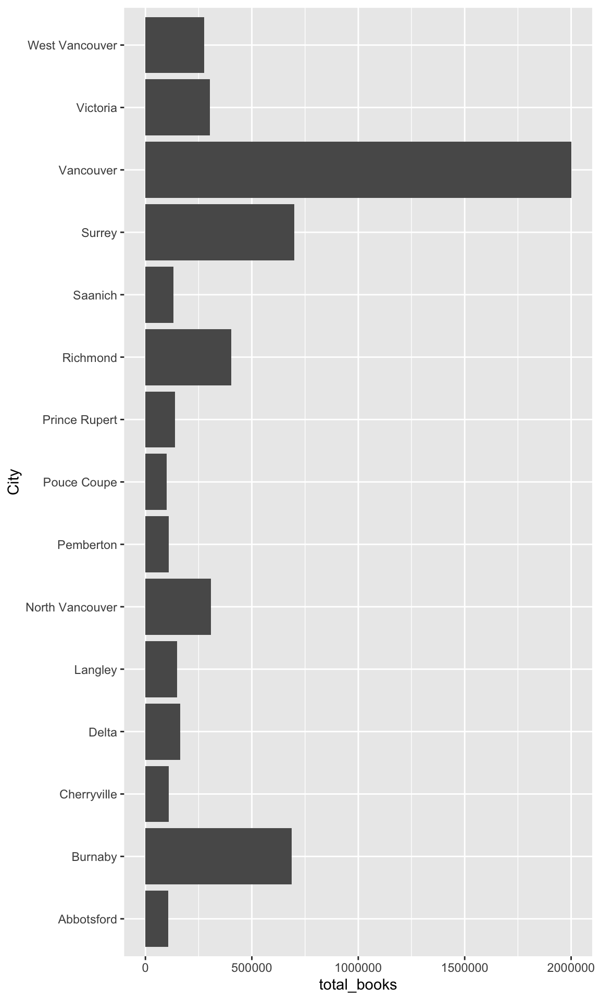

# Introduction to the bcdata package


The British Columbia government hosts over 2000 tabular and geospatial data sets
in the B.C. Data Catalogue. Most data is available through the B.C. Data
Catalogue under an open licence. The `bcdata` package provides programming
interfaces the B.C. Data Catalogue.  This allows R users to search, download and
import metadata and data from the B.C. Data Catalogue into their R session.
Through this functionality the `bcdata` package connects British Columbia
government public data holdings in the B.C. Data Catalogue with the vast
capabilities of R.


## Getting started

First we need to install the `bcdata` package:


```r
install.packages("bcdata")
```

And next we need to load the `bcdata` package, along with `dplyr` and `ggplot2` which we installed and used in earlier lessons:


```r
library(bcdata)
library(dplyr)
library(ggplot2)
```

## Searching the B.C. Data Catalogue

Let's use the `bcdata` package to search the B.C. Data Catalogue for some data on _**public libraries**_ in British Columbia:


```r
bcdc_search("public libraries")
```

```
List of B.C. Data Catalogue Records
Number of records: 16
 (Showing the top 10)
Titles:
1: BC Public Libraries Statistics 2002-Present (xls, xlsx, csv)
 ID: d03007d6-d6c7-44d7-b2f8-710ba9433617
 Name: bc-public-libraries-statistics-2002-present
2: BC Public Libraries Systems - Branches and Locations (multiple, csv,
 xlsx, kml, wms)
 ID: 3d2318d4-8f5d-4208-88f5-995420d7c58f
 Name: bc-public-libraries-systems-branches-and-locations
3: BC Web Map Library (kml, wms)
 ID: 6164a2af-d3ac-4e92-8dbe-51a93bb5e24b
 Name: bc-web-map-library
4: Environmental Protection Information Resources e-Library (other)
 ID: dae0f2c3-b4f4-4d16-a96d-d7fe7c1581f3
 Name: environmental-protection-information-resources-e-library
5: Biodiversity/Environmental Information Resources e-Library (html)
 ID: a77d4986-91a1-42fc-8e5c-51a304c7975e
 Name: biodiversity-environmental-information-resources-e-library
6: BC Geological Survey Publications Catalogue (html, csv)
 ID: 5f6d0659-f042-4552-9f23-8d92a9045328
 Name: bc-geological-survey-publications-catalogue
7: BC Laws API (html, openapi-json, json)
 ID: 6e815cf7-cb83-4655-9ad4-a926ae4e59f7
 Name: bc-laws-api
8: Ecological Catalogue (formerly AquaCat) (multiple, wms, kml)
 ID: 7904d8e9-64b4-4acc-89f1-70a42bc1da6e
 Name: ecological-catalogue-formerly-aquacat
9: Terrestrial Ecosystem Information (TEI) Data Distribution Packages
 (other)
 ID: 8fd15e4e-e7b1-4566-81d1-1ff8947bfd46
 Name: terrestrial-ecosystem-information-tei-data-distribution-packages
10: Predictive Ecosystem Mapping (PEM) Detailed Polygons with Short
 Attribute Table - 20,000 Spatial View (fgdb)
 ID: b9b3145e-f7f4-4150-a331-1334d3c38576
 Name:
  predictive-ecosystem-mapping-pem-detailed-polygons-with-short-attribute-table-20-000-spatial-view

Access a single record by calling `bcdc_get_record(ID)` with the ID
 from the desired record.
```

There are many catalogue records with data relating to libraries. Let's examine the first returned record more closely:


```r
bcdc_get_record("bc-public-libraries-systems-branches-and-locations")
```

```
Warning: It is advised to use the permanent id ('3d2318d4-8f5d-4208-88f5-995420d7c58f') rather than the name of the record ('bc-public-libraries-systems-branches-and-locations') to guard against future name changes.
```

```
B.C. Data Catalogue Record: BC Public Libraries Systems - Branches and
 Locations
Name: bc-public-libraries-systems-branches-and-locations (ID:
 3d2318d4-8f5d-4208-88f5-995420d7c58f)
Permalink:
 https://catalogue.data.gov.bc.ca/dataset/3d2318d4-8f5d-4208-88f5-995420d7c58f
Licence: Open Government Licence - British Columbia
Description: This dataset includes contact and location data for all
 library service points in BC. It also includes some primary data on
 library use and services from the most current year that data is
 available. 
 
 The dataset is geolocational, and is available in XLSX,
 CSV, and KML formats.
Available Resources (5):
 1. BC Public Library Service Points (csv)
 2. 2018 BC Public Library Systems - Locations and Branch Data (XLS) - v19 (xlsx)
 3. 2018 BC Public Library Systems - Locations and Branch Data (CSV) - v19 (csv)
 4. 2015 BC Public Library Systems - Locations and Branch Data 1.2 (KML) (kml)
 5. WMS getCapabilities request (wms)
Access the full 'Resources' data frame using:
 bcdc_tidy_resources('3d2318d4-8f5d-4208-88f5-995420d7c58f')
Query and filter this data using:
 bcdc_query_geodata('3d2318d4-8f5d-4208-88f5-995420d7c58f')
```

## Importing data from the B.C. Data Catalogue

Next, we can use the `bcdc_get_data` function to import this data directly into R: 


```r
bcdc_get_data(record = "bc-public-libraries-systems-branches-and-locations")
```


The _bc-public-libraries-systems-branches-and-locations_ catalogue record contains multiple data resources or files. If we run the above code interactively, R will prompt you in the console to select one of the available resources, as it does not know which one you want to download. The full code to import the resource from the record&mdash;using the record's permanent id to guard against future name changesname&mdash;is provided to the user for next time:


```r
lib_raw <- bcdc_get_data('3d2318d4-8f5d-4208-88f5-995420d7c58f',
                         resource = 'ed17f111-fb39-46b3-89aa-5375592fbb01')
```

```
Reading the data using the read_xlsx function from the readxl package.
```

> ## Challenge 1 (5 minutes)
>
> Take a few minutes to search the B.C. Data Catalogue for data sets for a different topic. Identify and import one tabular data set into your R session > (e.g. a CSV or XLS resource). Entering `bcdc_browse()` into the R console will open the catalogue page in your default web browser. 
>

## Practice manipulating data with `dplyr`  


Let's return to the libraries data frame `lib_raw` we imported. As we learned earlier in the workshop, a useful first step is to get familiar with the data:


```r
str(lib_raw)
```

```
tibble [253 × 38] (S3: tbl_df/tbl/data.frame)
 $ Library System                                               : chr [1:253] "Alert Bay Public Library & Museum" "Beaver Valley Public Library" "Bowen Island Public Library" "Burnaby Public Library" ...
 $ Location                                                     : chr [1:253] "Alert Bay Public Library & Museum" "Beaver Valley Public Library" "Bowen Island Public Library" "Bob Prittie Metrotown Branch" ...
 $ 1x Branch Unique ID                                          : chr [1:253] "BABM001" "BFBV001" "BBI001" "BB001" ...
 $ School District Served                                       : chr [1:253] "85" "20" "45" "41" ...
 $ Phone                                                        : chr [1:253] "(250) 974-5721" "(250) 367-7114" "(604) 947-9788" "(604) 436-5427" ...
 $ Physical Address                                             : chr [1:253] "116 Fir Street" "1847 - 1st Street" "430 Bowen Island Trunk" "6100 Willingdon Avenue" ...
 $ City                                                         : chr [1:253] "Alert Bay" "Fruitvale" "Bowen Island" "Burnaby" ...
 $ Province                                                     : chr [1:253] "BC" "BC" "BC" "BC" ...
 $ Postal Code                                                  : chr [1:253] "V0N 1A0" "V0G 1L0" "V0N 1G0" "V5H 4N5" ...
 $ Latitude                                                     : num [1:253] 50.6 49.1 49.4 49.2 49.3 ...
 $ Longitude                                                    : num [1:253] -127 -118 -123 -123 -123 ...
 $ 460x Total branch physical materials, volumes held           : num [1:253] 9361 25477 15100 373232 59958 ...
 $ 556x Branch circulation of print and other physical materials: num [1:253] 2460 19792 36155 1139184 454254 ...
 $ 565x Branch circulation of children's materials              : chr [1:253] "193" "4737" "15964" "476345" ...
 $ 610x Branch reference transactions                           : chr [1:253] "1700" "10000" "8217" "107784" ...
 $ 775x In person visits to this branch or service point        : chr [1:253] "3522" "14750" "52690" "749695" ...
 $ 680x Branch in-library adult programs                        : chr [1:253] "0" "8" "499" "58" ...
 $ 682x Branch outreach adult programs                          : chr [1:253] "1" "2" "0" "101" ...
 $ 690x Attendance at adult programs                            : chr [1:253] "22" "202" "1381" "3865" ...
 $ 700x Branch in-library children's programs                   : chr [1:253] "0" "100" "94" "402" ...
 $ 702x Branch outreach children's programs                     : chr [1:253] "3" "10" "5" "39" ...
 $ 710x Attendance at children's programs                       : chr [1:253] "235" "1208" "1224" "19522" ...
 $ 715x Branch in-library young adult programs                  : chr [1:253] "0" "0" "0" "12" ...
 $ 717x Branch outreach young adult programs                    : chr [1:253] "0" "0" "0" "84" ...
 $ 716x Attendance at young adult programs                      : chr [1:253] "0" "0" "0" "2923" ...
 $ 671x Branch in-library newcomer/ELL programs, all ages       : chr [1:253] "0" "0" "0" "26" ...
 $ 673x Branch outreach newcomer/ELL programs, all ages         : chr [1:253] "0" "0" "0" "0" ...
 $ 672x Attendance at branch newcomer/ELL programs              : chr [1:253] "0" "0" "0" "528" ...
 $ 740x Professional Librarians, hours worked at this branch    : chr [1:253] "0" "0" "1820" "42224" ...
 $ 742x Library Technicians, hours worked at this branch        : chr [1:253] "0" "0" "0" "1733" ...
 $ 752x Community Librarians, hours worked at this branch       : chr [1:253] "622" "4940" "0" NA ...
 $ 770x Other Staff, hours worked at this branch                : chr [1:253] "281" "1350" "4107" "104199" ...
 $ 975x Number of photocopiers in library branch                : num [1:253] 1 1 1 4 1 1 1 2 1 1 ...
 $ 852x Is this location LEED certified?                        : chr [1:253] NA "No" "No" "No" ...
 $ 854x Is this location a Shared Space facility?               : chr [1:253] NA "No" "Yes" "No" ...
 $ 860x Branch space/size, total square metres                  : num [1:253] 213 270 407 5673 465 ...
 $ 890x Hours open per year at this location                    : chr [1:253] "618" "2320" "1953" "3612" ...
 $ 920x Days open per year at this location                     : chr [1:253] "191" "321" "303" "339" ...
```

```r
names(lib_raw)
```

```
 [1] "Library System"                                               
 [2] "Location"                                                     
 [3] "1x Branch Unique ID"                                          
 [4] "School District Served"                                       
 [5] "Phone"                                                        
 [6] "Physical Address"                                             
 [7] "City"                                                         
 [8] "Province"                                                     
 [9] "Postal Code"                                                  
[10] "Latitude"                                                     
[11] "Longitude"                                                    
[12] "460x Total branch physical materials, volumes held"           
[13] "556x Branch circulation of print and other physical materials"
[14] "565x Branch circulation of children's materials"              
[15] "610x Branch reference transactions"                           
[16] "775x In person visits to this branch or service point"        
[17] "680x Branch in-library adult programs"                        
[18] "682x Branch outreach adult programs"                          
[19] "690x Attendance at adult programs"                            
[20] "700x Branch in-library children's programs"                   
[21] "702x Branch outreach children's programs"                     
[22] "710x Attendance at children's programs"                       
[23] "715x Branch in-library young adult programs"                  
[24] "717x Branch outreach young adult programs"                    
[25] "716x Attendance at young adult programs"                      
[26] "671x Branch in-library newcomer/ELL programs, all ages"       
[27] "673x Branch outreach newcomer/ELL programs, all ages"         
[28] "672x Attendance at branch newcomer/ELL programs"              
[29] "740x Professional Librarians, hours worked at this branch"    
[30] "742x Library Technicians, hours worked at this branch"        
[31] "752x Community Librarians, hours worked at this branch"       
[32] "770x Other Staff, hours worked at this branch"                
[33] "975x Number of photocopiers in library branch"                
[34] "852x Is this location LEED certified?"                        
[35] "854x Is this location a Shared Space facility?"               
[36] "860x Branch space/size, total square metres"                  
[37] "890x Hours open per year at this location"                    
[38] "920x Days open per year at this location"                     
```

Let's tidy up this data frame and find out how many books&mdash;physical materials or volumes&mdash;are available within each City:


```r
library(dplyr)

lib_tidy <- lib_raw %>%
  select(`Library System`, Location, City, num_books = "460x Total branch physical materials, volumes held")


sum_books <- lib_tidy %>% 
  group_by(City, `Library System`) %>% 
  summarize(total_books = sum(num_books))
```

```
`summarise()` has grouped output by 'City'. You can override using the
`.groups` argument.
```

> ## Challenge 2 (10 minutes)
>
> Using `dplyr`, determine the total number of books within each Library System in British Columbia.
>
>
> >## Solution Challenge 2 (10 minutes)
> >
> >```r
> > sum_books %>% 
> >  group_by(`Library System`) %>% 
> >  summarize(totals = sum(total_books))
> >```
> >
> >```
> ># A tibble: 71 × 2
> >   `Library System`                         totals
> >   <chr>                                     <dbl>
> > 1 Alert Bay Public Library & Museum          9361
> > 2 Beaver Valley Public Library              25477
> > 3 Bowen Island Public Library               15100
> > 4 Burnaby Public Library                   687751
> > 5 Burns Lake Public Library                 44271
> > 6 Cariboo Regional District Library System 254006
> > 7 Castlegar & District Public Library       75228
> > 8 Chetwynd Public Library                   28674
> > 9 Coquitlam Public Library                  87878
> >10 Cranbrook Public Library                  71823
> ># … with 61 more rows
> >```


## Practice plotting data with `ggplot2`  

Now that we have imported, tidied, and summarized our library data, let's make a static data visualization to share and communicate the results with others.


```r
library(ggplot2)

sum_books %>% 
  ggplot(aes(total_books, City)) +
  geom_col()
```


```r
sum_books %>% 
  filter(total_books > 100000) %>% 
  ggplot(aes(total_books, City)) +
  geom_col()
```



> ## Challenge 3 (10 minutes)
>
> Iterate the above plot to include information on the number of books by Library Service. Add a title to the plot. Try other design changes to make the plot more readable.
>
>
> >## Solution Challenge 3 (10 minutes)
> >
> >```r
> >library(ggplot2)
> >
> >sum_books %>% 
> >  filter(total_books > 100000) %>% 
> >  ggplot(aes(total_books, City)) +
> >  geom_col() +
> >  facet_wrap(vars(`Library System`)) +
> >  theme_minimal() +
> >  labs(x = NULL,
> >       y = NULL,
> >       title = "Total Number of Books by City & Library System in B.C.",
> >       caption = "Data sourced from the B.C. Data Catalogue")
> >```
> >
> >

> ## Challenge 4 (20 minutes)
>
> Navigate to the [BC Data Catalogue](https://catalogue.data.gov.bc.ca/datasets) and choose a dataset that has a `Resource Storage Format` that is `csv` or `xlsx`. > An example of this is the [BC Seafood Production data](https://catalogue.data.gov.bc.ca/dataset/bc-seafood-production-2018-2020). You can use this dataset or one > of your choosing. Import your data into R and make a plot, any plot at all. Try to apply the skills you've learned in this workshop to make a pretty plot. 
> 
> >## Solution to Challenge 4 
> >
> >```r
> >seafood_prod <- bcdc_get_data("e591a756-6b99-4986-b8ce-f341bd47228f", resource = '9cc32dc4-bd9a-4baf-8210-770ac62d7985')
> >```
> >
> >```
> >Reading the data using the read_csv function from the readr package.
> >```
> >
> >```
> >Rows: 111 Columns: 7
> >── Column specification ────────────────────────────────────────────────────────
> >Delimiter: ","
> >chr (3): Species Group, Source, Species/Product
> >dbl (4): Year, Harvest ('000 t), Landed Value ($ million), Wholesale Value (...
> >
> >ℹ Use `spec()` to retrieve the full column specification for this data.
> >ℹ Specify the column types or set `show_col_types = FALSE` to quiet this message.
> >```
> >
> >```r
> >seafood_by_year <- seafood_prod %>% 
> >  filter(Year == 2020) %>% 
> >  group_by(`Species/Product`) %>% 
> >  summarise(value = sum(`Wholesale Value ($ million)`)) 
> >
> >seafood_by_year %>% 
> >  ggplot(aes(y = `Species/Product`, x = value, fill = `Species/Product`)) +
> >  geom_col() +
> >  scale_fill_viridis_d() +
> >  scale_x_continuous(labels = scales::dollar) +
> >  guides(fill = "none") +
> >  theme_minimal() +
> >  labs(title = "B.C. Seafood Production - 2020", 
> >       xlab = "Wholesale Value ($ million)",
> >       caption = "BC Seafood Production, 2018 - 2020: https://catalogue.data.gov.bc.ca/dataset/e591a756-6b99-4986-b8ce-f341bd47228f") +
> >  theme(axis.title.x = element_blank())
> >```
> >
> >

