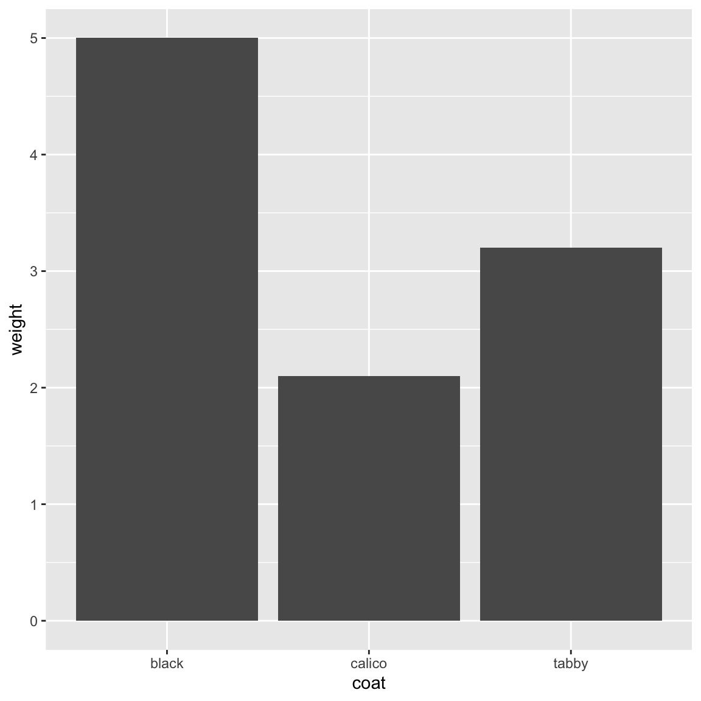

# Seeking Help from Others with reprex

If you're having trouble using a function or package, or getting the syntax correct, 9 times out of 10 the answers you are seeking have already been asked and answered on-line:

- [RStudio Community](https://community.rstudio.com/)
- [Stack Overflow](http://stackoverflow.com/). You can search using the [r] tag.
- [Google](https://www.google.ca/)

If you can't find the answer on-line, there are some on-line forums to seek help from the bcgov R community:

- [bcgov Yammer channels (e.g. R, Data Science CoP)](https://www.yammer.com/gov.bc.ca)


## Help People Help You - reprex

When starting a conversation about code, there are a few things that when included make that conversation more efficient and pleasant for everyone:

- some sample data (preferably provided _in_ the code)
- some code (with comments, white-space, indents `==` make it easy to read)
- information about your computing environment, like your operating system, version of R, the packages you have loaded


[`reprex`](https://reprex.tidyverse.org/index.html): An R package to help prepare a reproducible example --- or reprex --- for posting to GitHub issues, StackOverflow, RocketChat snippets, or email and so on.


```r
# install.packages("reprex")

# load libraries we need
library(reprex)
library(readr)
library(dplyr)
library(ggplot2)

# read in data
cats <- read_csv(file = "data/feline-data.csv")

# munge data and make bar plot
cats %>% 
  select(coat, weight) %>% 
  ggplot(aes(x = coat, y = weight)) +  
  geom_col()
```



```r
# error in syntax - this does not work
cats %>% 
  select(coat, weight) %>% 
  ggplot(aes(x = coat, y = weight)) %>%   
  geom_col()
```

```
Error in `validate_mapping()`:
! `mapping` must be created by `aes()`
Did you use %>% instead of +?
```

You have read the error message but it was not helpful, you used `?ggplot2`, and looked on-line and still cannot find an answer. Maybe someone in the bcgovR community knows? 

We need to invest a bit of time making the buggy code shareable -- the easier it is for someone to run the code, the easier -- and likely faster -- someone might be able to provide some help. 


If the data is shareable (e.g. available in the B.C. Data Catalogue with appropriate licence, publicly available) then we can use `dput()`:


```r
# use dput to make data set with code
dput(cats)
```

```
structure(list(coat = c("calico", "black", "tabby"), weight = c(2.1, 
5, 3.2), likes_string = c(1, 0, 1)), row.names = c(NA, -3L), spec = structure(list(
    cols = list(coat = structure(list(), class = c("collector_character", 
    "collector")), weight = structure(list(), class = c("collector_double", 
    "collector")), likes_string = structure(list(), class = c("collector_double", 
    "collector"))), default = structure(list(), class = c("collector_guess", 
    "collector")), delim = ","), class = "col_spec"), problems = <pointer: 0x7fbb34c9b600>, class = c("spec_tbl_df", 
"tbl_df", "tbl", "data.frame"))
```

```r
cats <- structure(list(coat = c("calico", "black", "tabby"), weight = c(2.1, 
5, 3.2), likes_string = c(1, 0, 1)), class = c("spec_tbl_df", 
"tbl_df", "tbl", "data.frame"), row.names = c(NA, -3L), spec = structure(list(
    cols = list(coat = structure(list(), class = c("collector_character", 
    "collector")), weight = structure(list(), class = c("collector_double", 
    "collector")), likes_string = structure(list(), class = c("collector_double", 
    "collector"))), default = structure(list(), class = c("collector_guess", 
    "collector")), skip = 1), class = "col_spec"))

# error in syntax - this does not work
cats %>% 
  select(coat, weight) %>% 
  ggplot(aes(x = coat, y = weight)) %>%  
  geom_col()
```

```
Error in `validate_mapping()`:
! `mapping` must be created by `aes()`
Did you use %>% instead of +?
```

`dput()` will dump the data you're working with into a format so that it can
be copy and pasted by anyone else into their R session.

If the data is _*not*_ shareable, you can use some built in data and re-create the issue:


```r
# ?datasets # built in datasets
# ?starwars # ships with dplyr

# View(starwars)

# error in syntax - this does not work
starwars %>% 
  select(name, height) %>% 
  ggplot(aes(x = name, y = height)) %>%  
  geom_col()
```

```
Error in `validate_mapping()`:
! `mapping` must be created by `aes()`
Did you use %>% instead of +?
```

Once the code is ready for sharing, select the code and use `reprex_selection()` or the clickable RStudio `Addin` Reprex selection button to copy the formatted code to the clipboard for sharing on-line (_demonstrated_).


Sometimes it is useful to share information about your computing environment as well:


```r
sessionInfo()
```

```
R version 4.1.2 (2021-11-01)
Platform: x86_64-apple-darwin17.0 (64-bit)
Running under: macOS Big Sur 10.16

Matrix products: default
BLAS:   /Library/Frameworks/R.framework/Versions/4.1/Resources/lib/libRblas.0.dylib
LAPACK: /Library/Frameworks/R.framework/Versions/4.1/Resources/lib/libRlapack.dylib

locale:
[1] en_US.UTF-8/en_US.UTF-8/en_US.UTF-8/C/en_US.UTF-8/en_US.UTF-8

attached base packages:
[1] stats     graphics  grDevices utils     datasets  methods   base     

other attached packages:
[1] ggplot2_3.3.5 dplyr_1.0.8   readr_2.1.2   reprex_2.0.1  knitr_1.37   

loaded via a namespace (and not attached):
 [1] tidyselect_1.1.2 xfun_0.29        bslib_0.3.1      purrr_0.3.4     
 [5] colorspace_2.0-3 vctrs_0.3.8      generics_0.1.2   htmltools_0.5.2 
 [9] yaml_2.3.5       utf8_1.2.2       rlang_1.0.1      jquerylib_0.1.4 
[13] pillar_1.7.0     glue_1.6.1       withr_2.4.3      DBI_1.1.2       
[17] bit64_4.0.5      lifecycle_1.0.1  stringr_1.4.0    munsell_0.5.0   
[21] gtable_0.3.0     memoise_2.0.1    evaluate_0.15    labeling_0.4.2  
[25] tzdb_0.2.0       fastmap_1.1.0    parallel_4.1.2   fansi_1.0.2     
[29] highr_0.9        scales_1.1.1     cachem_1.0.6     vroom_1.5.7     
[33] jsonlite_1.8.0   farver_2.1.0     fs_1.5.2         bit_4.0.4       
[37] hms_1.1.1        digest_0.6.29    stringi_1.7.6    bookdown_0.24   
[41] grid_4.1.2       cli_3.2.0        tools_4.1.2      magrittr_2.0.2  
[45] sass_0.4.0       tibble_3.1.6     crayon_1.5.0     pkgconfig_2.0.3 
[49] downlit_0.4.0    ellipsis_0.3.2   xml2_1.3.3       assertthat_0.2.1
[53] rmarkdown_2.11   R6_2.5.1         compiler_4.1.2  
```

`sessionInfo()` will print out your current version of R, as well as any packages you
have loaded. This can be useful to help reproduce and debug
your issue.


## Other Helpful Resources

* [RStudio cheat sheets](http://www.rstudio.com/resources/cheatsheets/)
* [Quick R](http://www.statmethods.net/)
* [Cookbook for R](http://www.cookbook-r.com/)

