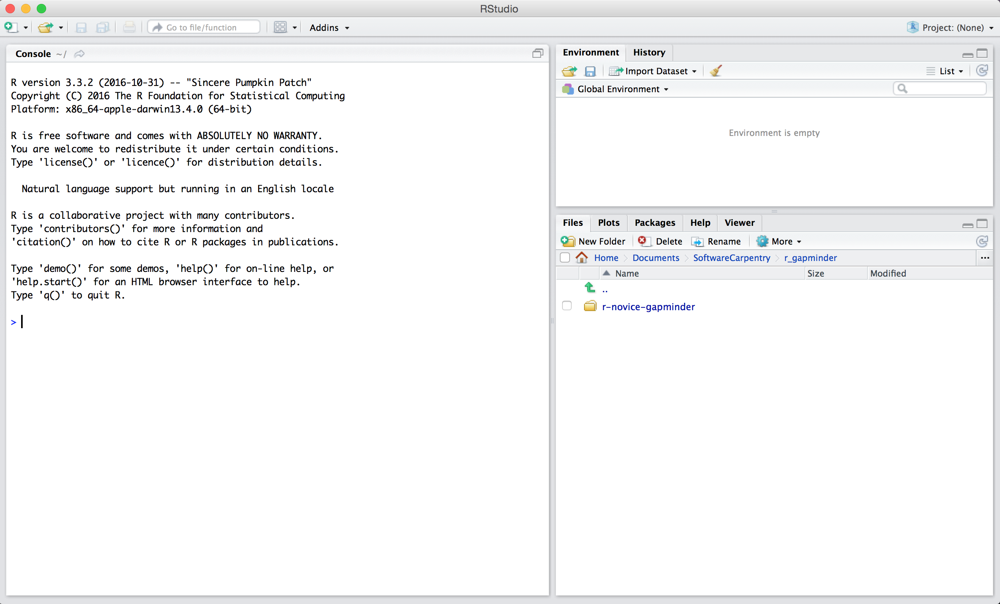

# Preface


A repository to house materials for a 1-day course introducing participants to data science using [R](https://www.r-project.org/).


The goal of this 2-day workshop is to teach _new-to-programming_ data professionals to import data, clean up and summarize a data set, and make some static data visualizations using the program R. R is a popular statistical computing language, commonly used in many scientific disciplines for statistical analysis, generating production-quality graphics, and automating data workflow tasks. The workshop content will follow best practices for using R for data analysis, giving attendees a foundation in the fundamentals of R and scientific computing.


Most of the above lesson material is sourced from the Software Carpentry Foundation (now The Carpenties) [R for Reproducible Scientific Analysis](http://swcarpentry.github.io/r-novice-gapminder/) lesson material: Thomas Wright and Naupaka Zimmerman (eds): _Software Carpentry: R for
Reproducible Scientific Analysis_.  Version 2016.06, June 2016,
https://github.com/swcarpentry/r-novice-gapminder,
10.5281/zenodo.57520.


Original Work Copyright © [Software Carpentry](http://software-carpentry.org/), content modified by the Province of British Columbia.

This work is licensed under the Creative Commons Attribution 4.0 International License.
To view a copy of this license, visit http://creativecommons.org/licenses/by/4.0/.

[](http://creativecommons.org/licenses/by/4.0/). 

<!--chapter:end:index.Rmd-->

---
title: "Introduction to R and RStudio"
teaching: 45
exercises: 10
questions:
- "How to find your way around RStudio?"
- "How to interact with R?"
- "How to manage your environment?"
- "How to install packages?"
objectives:
- "Describe the purpose and use of each pane in the RStudio IDE"
- "Locate buttons and options in the RStudio IDE"
- "Define a variable"
- "Assign data to a variable"
- "Manage a workspace in an interactive R session"
- "Use mathematical and comparison operators"
- "Call functions"
- "Manage packages"
keypoints:
- "Use RStudio to write and run R programs."
- "R has the usual arithmetic operators and mathematical functions."
- "Use `<-` to assign values to variables."
- "Use `ls()` to list the variables in a program."
- "Use `rm()` to delete objects in a program."
- "Use `install.packages()` to install packages (libraries)."
source: Rmd
---

```{r, include=FALSE}
source("bin/chunk-options.R")
knitr_fig_path("01-")
```

# Introduction to R and RStudio

## Motivation

Science is a multi-step process: once you've designed an experiment and collected
data, the real fun begins! This lesson will teach you how to start this process using
R and RStudio. We will begin with raw data, perform exploratory analyses, and learn
how to plot results graphically. This example starts with a dataset from
[gapminder.org](https://www.gapminder.org) containing population information for many
countries through time. Can you read the data into R? Can you plot the population for
Senegal? Can you calculate the average income for countries on the continent of Asia?
By the end of these lessons you will be able to do things like plot the populations
for all of these countries in under a minute!

## Before Starting The Workshop

Please ensure you have the latest version of R and RStudio installed on your machine. This is important, as some packages used in the workshop may not install correctly (or at all) if R is not up to date.

[Download and install the latest version of R here](https://www.r-project.org/)
[Download and install RStudio here](https://www.rstudio.com/)

There is one bit of customization we need to do to make R play nicely on
a bcgov computer: 

Open command prompt (Open Start Menu then type `cmd` and press [Enter]).
Type the following line into the command prompt window exactly as shown:

```
setx HOME "%USERPROFILE%"
```

Press [Enter], you should see **SUCCESS: Specified value was saved**.
Quit command prompt by typing `exit` then pressing [Enter]

## Introduction to RStudio

Welcome to the R portion of the Software Carpentry workshop.

Throughout this lesson, we're going to teach you some of the fundamentals of
the R language as well as some best practices for organizing code for
scientific projects that will make your life easier.

We'll be using RStudio: a free, open source R integrated development
environment. It provides a built in editor, works on all platforms (including
on servers) and provides many advantages such as integration with version
control and project management.


**Basic layout**

When you first open RStudio, you will be greeted by three panels:

  * The interactive R console (entire left)
  * Environment/History (tabbed in upper right)
  * Files/Plots/Packages/Help/Viewer (tabbed in lower right)



Once you open files, such as R scripts, an editor panel will also open
in the top left.


## Work flow within RStudio
There are two main ways one can work within RStudio.

1. Test and play within the interactive R console then copy code into
a .R file to run later.
   *  This works well when doing small tests and initially starting off.
   *  It quickly becomes laborious
2. Start writing in an .R file and use RStudio's short cut keys for the Run command
to push the current line, selected lines or modified lines to the
interactive R console.
   * This is a great way to start; all your code is saved for later
   * You will be able to run the file you create from within RStudio
   or using R's `source()`  function.

> ## Tip: Running segments of your code
>
> RStudio offers you great flexibility in running code from within the editor
> window. There are buttons, menu choices, and keyboard shortcuts. To run the
> current line, you can 
> 1. click on the `Run` button above the editor panel, or 
> 2. select "Run Lines" from the "Code" menu, or 
> 3. hit <kbd>Ctrl</kbd>+<kbd>Return</kbd> in Windows or Linux 
> or <kbd>&#8984;</kbd>+<kbd>Return</kbd> on OS X.
> (This shortcut can also be seen by hovering
> the mouse over the button). To run a block of code, select it and then `Run`.
> If you have modified a line of code within a block of code you have just run,
> there is no need to reselect the section and `Run`, you can use the next button
> along, `Re-run the previous region`. This will run the previous code block
> including the modifications you have made.


## Introduction to R

Much of your time in R will be spent in the R interactive console. This is where
you can run your code line-by-line, and can be a useful environment to try out
ideas before adding them to an R script file. This console in RStudio is the
same as the one you would get if you typed in `R` in your command-line
environment.
The first thing you will see in the R interactive session is a bunch of
information, followed by a ">" and a blinking cursor. It operates on a "Read,
evaluate, print loop": you type in commands, R tries to execute them, and then
returns a result.

## Using R as a calculator

The simplest thing you could do with R is do arithmetic:

```{r}
1 + 100
```

And R will print out the answer, with a preceding "[1]". Don't worry about this
for now, we'll explain that later. For now think of it as indicating output.

If you type in an incomplete command, R will wait for you to
complete it:

~~~
> 1 +
~~~

~~~
+
~~~

Any time you hit return and the R session shows a "+" instead of a ">", it
means it's waiting for you to complete the command. If you want to cancel
a command you can simply hit "Esc" and RStudio will give you back the ">"
prompt.

> ## Tip: Cancelling commands
>
> Cancelling a command isn't only useful for killing incomplete commands:
> you can also use it to tell R to stop running code (for example if it's
> taking much longer than you expect), or to get rid of the code you're
> currently writing.
>

When using R as a calculator, the order of operations is the same as you
would have learned back in school.

From highest to lowest precedence:

 * Parentheses: `(`, `)`
 * Exponents: `^` or `**`
 * Divide: `/`
 * Multiply: `*`
 * Add: `+`
 * Subtract: `-`

```{r}
3 + 5 * 2
```

Use parentheses to group operations in order to force the order of
evaluation if it differs from the default, or to make clear what you
intend.

```{r}
(3 + 5) * 2
```

This can get unwieldy when not needed, but  clarifies your intentions.
Remember that others may later read your code.

```{r, eval=FALSE}
(3 + (5 * (2 ^ 2))) # hard to read
3 + 5 * 2 ^ 2       # clear, if you remember the rules
3 + 5 * (2 ^ 2)     # if you forget some rules, this might help
```


The text after each line of code is called a
"comment". Anything that follows after the hash (or octothorpe) symbol
`#` is ignored by R when it executes code.

Really small or large numbers get a scientific notation:

```{r}
2/10000
```

Which is shorthand for "multiplied by `10^XX`". So `2e-4`
is shorthand for `2 * 10^(-4)`.

You can write numbers in scientific notation too:

```{r}
5e3  # Note the lack of minus here
```

## Mathematical functions

R has many built in mathematical functions. To call a function,
we simply type its name, followed by open and closing parentheses.
Anything we type inside the parentheses is called the function's
arguments:

```{r}
sum(1, 2, 3, 4, 5)
```


```{r}
sin(1)  # trigonometry functions
```

```{r}
log(1)  # natural logarithm
```

```{r}
log10(10) # base-10 logarithm
```

```{r}
exp(0.5) # e^(1/2)
```

Don't worry about trying to remember every function in R. You
can simply look them up on Google, or if you can remember the
start of the function's name, use the tab completion in RStudio.

This is one advantage that RStudio has over R on its own, it
has auto-completion abilities that allow you to more easily
look up functions, their arguments, and the values that they
take.

Typing a `?` before the name of a command will open the help page
for that command. As well as providing a detailed description of
the command and how it works, scrolling to the bottom of the
help page will usually show a collection of code examples which
illustrate command usage. We'll go through an example later.

## Comparing things

We can also do comparison in R:

```{r}
1 == 1  # equality (note two equals signs, read as "is equal to")
```

```{r}
1 != 2  # inequality (read as "is not equal to")
```

```{r}
1 < 2  # less than
```

```{r}
1 <= 1  # less than or equal to
```

```{r}
1 > 0  # greater than
```

```{r}
1 >= -9 # greater than or equal to
```

> ## Tip: Comparing Numbers
>
> A word of warning about comparing numbers: you should
> never use `==` to compare two numbers unless they are
> integers (a data type which can specifically represent
> only whole numbers).
>
> Computers may only represent decimal numbers with a
> certain degree of precision, so two numbers which look
> the same when printed out by R, may actually have
> different underlying representations and therefore be
> different by a small margin of error (called Machine
> numeric tolerance).
>
> Instead you should use the `all.equal` function.
>
> Further reading: [http://floating-point-gui.de/](http://floating-point-gui.de/)
>


## Variables and assignment

We can store values in variables using the assignment operator `<-`, like this:

```{r}
x <- 5
```

Notice that assignment does not print a value. Instead, we stored it for later
in something called a **variable**. `x` now contains the **value** `5`:

```{r}
x
```

More precisely, the stored value is a *decimal approximation* of
this fraction called a [floating point number](http://en.wikipedia.org/wiki/Floating_point).

Look for the `Environment` tab in one of the panes of RStudio, and you will see that `x` and its value
have appeared. Our variable `x` can be used in place of a number in any calculation that expects a number:

```{r}
log(x)
```

Notice also that variables can be reassigned:

```{r}
x <- 100
```

`x` used to contain the value 5 and and now it has the value 100.

Assignment values can contain the variable being assigned to:

```{r}
x <- x + 1 #notice how RStudio updates its description of x on the top right tab
y <- x * 2
```

The right hand side of the assignment can be any valid R expression.
The right hand side is *fully evaluated* before the assignment occurs.

Variable names can contain letters, numbers, underscores and periods. They
cannot start with a number nor contain spaces at all. Different people use
different conventions for long variable names, these include

  * periods.between.words
  * underscores\_between_words
  * camelCaseToSeparateWords

What you use is up to you, but **be consistent**.

It is also possible to use the `=` operator for assignment:

```{r}
x = 1/40
```

But this is much less common among R users.  The most important thing is to
**be consistent** with the operator you use. There are occasionally places
where it is less confusing to use `<-` than `=`, and it is the most common
symbol used in the community. So the recommendation is to use `<-`.

> ## Challenge 1
>
> Which of the following are valid R variable names?
> ```{r, eval=FALSE}
> min_height
> max.height
> _age
> .mass
> MaxLength
> min-length
> 2widths
> celsius2kelvin
> ```
>
> > ## Solution to challenge 1
> >
> > The following can be used as R variables:
> > ```{r ch1pt1-sol, eval=FALSE}
> > min_height
> > max.height
> > MaxLength
> > celsius2kelvin
> > ```
> >
> > The following creates a hidden variable:
> > ```{r ch1pt2-sol, eval=FALSE}
> > .mass
> > ```
> >
> > The following will not be able to be used to create a variable
> > ```{r ch1pt3-sol, eval=FALSE}
> > _age
> > min-length
> > 2widths
> > ```


## Vectorization

One final thing to be aware of is that R is *vectorized*, meaning that
variables and functions can have vectors as values. In contrast to physics and
mathematics, a vector in R describes a set of values in a certain order of the 
same data type. For example

```{r}
1:5
2 * (1:5)
x <- 1:5
2 * x
y <- c(1, 3, 5, 7, 9)
y
```

This is incredibly powerful; we will discuss this further in an
upcoming lesson.


## Managing your environment

There are a few useful commands you can use to interact with the R session.

`ls` will list all of the variables and functions stored in the global environment
(your working R session):

```{r}
ls()
```

> ## Tip: hidden objects
>
> Like in the shell, `ls` will hide any variables or functions starting
> with a "." by default. To list all objects, type `ls(all.names=TRUE)`
> instead
>


Note here that we didn't give any arguments to `ls`, but we still
needed to give the parentheses to tell R to call the function.

If we type `ls` by itself, R will print out the source code for that function!

```{r}
ls
```

You can use `rm` to delete objects you no longer need:

```{r, eval=FALSE}
rm(x)
```

If you have lots of things in your environment and want to delete all of them,
you can pass the results of `ls` to the `rm` function:

```{r, eval=FALSE}
rm(list = ls())
```


> ## Tip: Warnings vs. Errors
>
> Pay attention when R does something unexpected! Errors, like above,
> are thrown when R cannot proceed with a calculation. Warnings on the
> other hand usually mean that the function has run, but it probably
> hasn't worked as expected.
>
> In both cases, the message that R prints out usually give you clues
> how to fix a problem.
>


## R Packages

Think of packages like apps on your smart phone. Your phone can do a lot of
things right out of the box, but you can get apps to make some existing
functionality better (like a better timer), or allow you to do new and amazing
things with your phone (like play Cwazy Cupcakes).

Similarly, R comes with many functions built in, but it is possible to add
functions to R by obtaining a package written by someone else. As of this
writing, there are over 10,000 packages available on CRAN (the comprehensive R
archive network).

R and RStudio have functionality for managing packages:

* You can see what packages are installed by typing
  `installed.packages()`
* You can install packages by typing `install.packages("packagename")`,
  where `packagename` is the package name, in quotes.
* You can update installed packages by typing `update.packages()`
* You can remove a package with `remove.packages("packagename")`
* You can make a package available for use with `library(packagename)`

> ## Challenge 2
>
> What will be the value of each  variable  after each
> statement in the following program?
>
> ```{r, eval=FALSE}
> mass <- 47.5
> age <- 122
> mass <- mass * 2.3
> age <- age - 20
> ```
>
> > ## Solution to challenge 2
> >
> > ```{r ch2pt1-sol}
> > mass <- 47.5
> > ```
> > This will give a value of `r mass` for the variable mass
> >
> > ```{r ch2pt2-sol}
> > age <- 122
> > ```
> > This will give a value of `r age` for the variable age
> >
> > ```{r ch2pt3-sol}
> > mass <- mass * 2.3
> > ```
> > This will multiply the existing value of `r mass/2.3` by 2.3 to give a new value of
> > `r mass` to the variable mass.
> >
> > ```{r ch2pt4-sol}
> > age <- age - 20
> > ```
> > This will subtract 20 from the existing value of `r age + 20 ` to give a new value
> > of `r age` to the variable age.


> ## Challenge 3
>
> Run the code from the previous challenge, and write a command to
> compare mass to age. Is mass larger than age?
>
> > ## Solution to challenge 3
> >
> > One way of answering this question in R is to use the `>` to set up the following:
> > ```{r ch3-sola}
> > mass > age
> >```
> > This should yield a boolean value of TRUE since `r mass` is greater than `r age`.


> ## Challenge 4
>
> Clean up your working environment by deleting the mass and age
> variables.
>
> > ## Solution to challenge 4
> >
> > We can use the `rm` command to accomplish this task
> > ```{r ch4-sol}
> > rm(age, mass)
> > ```


> ## Challenge 5
>
> Install the following packages: `ggplot2`, `plyr`, `gapminder`
>
> > ## Solution to challenge 5
> >
> > We can use the `install.packages()` command to install the required packages.
> > ```{r ch5-sol, eval=FALSE}
> > install.packages("ggplot2")
> > install.packages("plyr")
> > install.packages("gapminder")
> >```


<!--chapter:end:01-rstudio-intro.Rmd-->

---
title: "Seeking Help in R"
teaching: 10
exercises: 10
questions:
- "How can I get help in R?"
objectives:
- "To be able read R help files for functions and special operators."
- "To be able to use CRAN task views to identify packages to solve a problem."
keypoints:
- "Use `help()` to get online help in R."
source: Rmd
---

```{r, include=FALSE}
source("bin/chunk-options.R")
knitr_fig_path("03-")
```

# Seeking Help in R

## Reading Help files

R, and every package, provide help files for functions. The general syntax to search for help on any
function, "function_name", from a specific function that is in a package loaded into your
namespace (your interactive R session):

```{r, eval=FALSE}
?function_name
help(function_name)
```

This will load up a help page in RStudio (or as plain text in R by itself).

Each help page is broken down into sections:

 - Description: An extended description of what the function does.
 - Usage: The arguments of the function and their default values.
 - Arguments: An explanation of the data each argument is expecting.
 - Details: Any important details to be aware of.
 - Value: The data the function returns.
 - See Also: Any related functions you might find useful.
 - Examples: Some examples for how to use the function.

Different functions might have different sections, but these are the main ones you should be aware of.

> ## Tip: Running Examples
>
> From within the function help page, you can highlight code in the 
> Examples and hit <kbd>Ctrl</kbd>+<kbd>Return</kbd> to run it in 
> RStudio console. This is gives you a quick way to get a feel for
> how a function works.

> ## Tip: Reading help files
>
> One of the most daunting aspects of R is the large number of functions
> available. It would be prohibitive, if not impossible to remember the
> correct usage for every function you use. Luckily, the help files
> mean you don't have to!


## Special Operators

To seek help on special operators, use quotes:

```{r, eval=FALSE}
?"<-"
```

## Getting help on packages

Many packages come with "vignettes": tutorials and extended example documentation.
Without any arguments, `vignette()` will list all vignettes for all installed packages;
`vignette(package="package-name")` will list all available vignettes for
`package-name`, and `vignette("vignette-name")` will open the specified vignette.

If a package doesn't have any vignettes, you can usually find help by typing
`help("package-name")`.

## When you kind of remember the function

If you're not sure what package a function is in, or how it's specifically spelled you can do a fuzzy search:

```{r, eval=FALSE}
??function_name
```

## When you have no idea where to begin

If you don't know what function or package you need to use
[CRAN Task Views](http://cran.at.r-project.org/web/views)
is a specially maintained list of packages grouped into
fields. This can be a good starting point.

> ## Challenge 1
>
> Look at the help for the `sum` function. What are two ways you can pass numbers 
> into the function so the are added together:
> ```{r, eval=FALSE}
> ?sum
> sum(1, 2, 3, 4, 5)
> x <- c(1, 2, 3)
> sum(x)
> ```

> ## Challenge 2
>
> Look at the help for the `paste` function. You'll need to use this later.
> What is the difference between the `sep` and `collapse` arguments?
>
> > ## Solution to Challenge 2
> >
> > To look at the help for the `paste()` function, use:
> > ```{r, eval=FALSE}
> > help("paste")
> > ?paste
> > ```
> > The difference between `sep` and `collapse` is a little
> > tricky. The `paste` function accepts any number of arguments, each of which
> > can be a vector of any length. The `sep` argument specifies the string
> > used between concatenated terms — by default, a space. The result is a
> > vector as long as the longest argument supplied to `paste`. In contrast,
> > `collapse` specifies that after concatenation the elements are *collapsed*
> > together using the given separator, the result being a single string.
> > e.g. 
> > ```{r} 
> > paste(c("a","b"), "c")
> > paste(c("a","b"), "c", sep = ",")
> > paste(c("a","b"), "c", collapse = "|")
> > paste(c("a","b"), "c", sep = ",", collapse = "|")
> > ```
> > (For more information,
> > scroll to the bottom of the `?paste` help page and look at the
> > examples, or try `example('paste')`.)


> ## Challenge 3
> Use help to find a function (and its associated parameters) that you could
> use to load data from a csv file in which columns are delimited with "\t"
> (tab) and the decimal point is a "." (period). This check for decimal
> separator is important, especially if you are working with international
> colleagues, because different countries have different conventions for the
> decimal point (i.e. comma vs period).
> hint: use `??csv` to lookup csv related functions.
>
> > ## Solution to Challenge 3
> >
> >
> > The standard R function for reading tab-delimited files with a period
> > decimal separator is read.delim(). You can also do this with
> > `read.table(file, sep="\t")` (the period is the *default* decimal
> > separator for `read.table()`, although you may have to change
> > the `comment.char` argument as well if your data file contains
> > hash (#) characters


<!--chapter:end:02-seeking-help.Rmd-->

---
title: "Project Management With RStudio"
teaching: 20
exercises: 10
questions:
- "How can I manage my projects in R?"
objectives:
- "Create self-contained projects in RStudio"
keypoints:
- "Use RStudio to create and manage projects with consistent layout."
- "Treat raw data as read-only."
- "Treat generated output as disposable."
- "Separate function definition and application."
source: Rmd
---

```{r, include=FALSE}
source("bin/chunk-options.R")
knitr_fig_path("02-")
```

# Project Management With RStudio

## Introduction

The scientific process is naturally incremental, and many projects
start life as random notes, some code, then a manuscript, and
eventually everything is a bit mixed together.

<blockquote class="twitter-tweet"><p>Managing your projects in a reproducible fashion doesn't just make your science reproducible, it makes your life easier.</p>— Vince Buffalo (@vsbuffalo) <a href="https://twitter.com/vsbuffalo/status/323638476153167872">April 15, 2013</a></blockquote>
<script async src="//platform.twitter.com/widgets.js" charset="utf-8"></script>

Most people tend to organize their projects like this:


There are many reasons why we should *ALWAYS* avoid this:

1. It is really hard to tell which version of your data is
the original and which is the modified;
2. It gets really messy because it mixes files with various
extensions together;
3. It probably takes you a lot of time to actually find
things, and relate the correct figures to the exact code
that has been used to generate it;

A good project layout will ultimately make your life easier:

* It will help ensure the integrity of your data;
* It makes it simpler to share your code with someone else
(a lab-mate, collaborator, or supervisor);
* It allows you to easily upload your code with your manuscript submission;
* It makes it easier to pick the project back up after a break.

## A possible solution

Fortunately, there are tools and packages which can help you manage your work effectively.

One of the most powerful and useful aspects of RStudio is its project management
functionality. We'll be using this today to create a self-contained, reproducible
project.


> ## Challenge: Creating a self-contained project
>
> We're going to create a new project in RStudio:
> 
> First, we are going to download the course content. Download the zipfile from: 
> <https://bit.ly/2oJNI50> and save it somewhere where you can find it 
> (e.g., your desktop), then unzip it.
> You should have a folder called `ds-cop-intro-to-r` with a `README.md` file 
> and a `data` folder.
>
> 1. Click the "File" menu button, then "New Project".
> 2. Click "Existing Directory".
> 3. Browse to the folder we just extracted.
> 6. Click the "Create Project" button.

Now when we open this project with RStudio, all of our work on this project will 
be entirely self-contained in this directory.

## Best practices for project organization

Although there is no "best" way to lay out a project, there are some general
principles to adhere to that will make project management easier:

### Treat data as read only

This is probably the most important goal of setting up a project. Data is
typically time consuming and/or expensive to collect. Working with them
interactively (e.g., in Excel) where they can be modified means you are never
sure of where the data came from, or how it has been modified since collection.
It is therefore a good idea to treat your data as "read-only".

### Data Cleaning

In many cases your data will be "dirty": it will need significant pre-processing
to get into a format R (or any other programming language) will find useful.
This task is sometimes called "data munging". Storing these scripts in a
separate folder, and creating a second "read-only" data folder to hold the
"cleaned" data sets can prevent confusion between the two sets.

### Treat generated output as disposable

Anything generated by your scripts should be treated as disposable: it should
all be able to be regenerated from your scripts.

There are lots of different ways to manage this output. Having an output folder
with different sub-directories for each separate analysis makes it easier later.
Since many analyses are exploratory and don't end up being used in the final
project, and some of the analyses get shared between projects.

> ## Tip: Good Enough Practices for Scientific Computing
>
> [Good Enough Practices for Scientific Computing](https://github.com/swcarpentry/good-enough-practices-in-scientific-computing/blob/gh-pages/good-enough-practices-for-scientific-computing.pdf) gives the following recommendations for project organization:
>
> 1. Put each project in its own directory, which is named after the project.
> 2. Put text documents associated with the project in the `doc` directory.
> 3. Put raw data and metadata in the `data` directory, and files generated during cleanup and analysis in a `results` directory.
> 4. Put source for the project's scripts and programs in the `src` directory, and programs brought in from elsewhere or compiled locally in the `bin` directory.
> 5. Name all files to reflect their content or function.
>

### Separate function definition and application

One of the more effective ways to work with R is to start by writing the code you want to run directly in an .R script, and then running the selected lines (either using the keyboard shortcuts in RStudio or clicking the "Run" button) in the interactive R console.

When your project is in its early stages, the initial .R script file usually contains many lines
of directly executed code. As it matures, reusable chunks get pulled into their
own functions. It's a good idea to separate these functions into two separate folders; one
to store useful functions that you'll reuse across analyses and projects, and
one to store the analysis scripts.

### Version Control

It is important to use version control with projects.  Go [here for a good lesson which describes using Git with RStudio](https://swcarpentry.github.io/git-novice/14-supplemental-rstudio/).


<!--chapter:end:03-project-intro.Rmd-->

---
title: "Data Structures"
teaching: 40
exercises: 15
questions:
- "How can I load a package in R?"
- "What is the 'tidyverse'?"
- "How can I read data in R?"
- "What are the basic data types in R?"
- "How do I represent categorical information in R?"
objectives:
- "To be aware of the different types of data."
- "To begin exploring data frames, and understand how they are related to vectors, factors and lists."
- "To be able to ask questions from R about the type, class, and structure of an object."
keypoints:
- "Use `readr::read_csv` to read tabular data in R."
- "The basic data types in R are double, integer, complex, logical, and character."
- "Use factors to represent categories in R."
source: Rmd
---

```{r, include=FALSE}
source("bin/chunk-options.R")
knitr_fig_path("04-")
```

# Data Structures

One of R's most powerful features is its ability to deal with tabular data -
such as you may already have in a spreadsheet or a CSV file. Let's start by
looking at a toy dataset in your `data/` directory, called `feline-data.csv`:

The contents of the new file, `feline-data.csv`:
```{r, eval=FALSE}
coat,weight,likes_string
calico,2.1,1
black,5.0,0
tabby,3.2,1
```

## The *readr* package

To read the data into R, we are going to use our first package, called *readr*. 
*readr* is part of a suite of packages called the "tidyverse" which were designed
to work nicely together and to ease many common data operations.

The first time you use a package, you will need to install it (like installing
an app on your phone from the app store). Additionally, it is a good idea to
periodically check for updates to that package:

```{r, eval=FALSE}
install.packages("readr")
```

Everytime we want to use that package, you must load it into your R session, by 
using the `library` function:

```{r}
library(readr)
```

Now we can load this data into R via the following using the `read_csv` function, 
and assign it to an object called `cats`:

```{r}
cats <- read_csv(file = "data/feline-data.csv")
cats
```

The `read_csv` function is used for reading in tabular data stored in a text
file where the columns of data are separated by punctuation characters such as
CSV files (csv = comma-separated values). There is a base version of this called
`read.csv`, but the `readr` version (`read_csv`) is a bit more user-friendly, and 
uses more sensible defaults. Tabs and commas are the most common
punctuation characters used to separate or delimit data points in text files.

The object that is created by `read_csv` is called a "data.frame" - a rectangular
table-like object with rows and columns.

We can begin exploring our dataset right away, first by looking at the whole thing:

```{r}
cats
```

And pulling out individual columns by specifying them using the `$` operator:

```{r}
cats$weight
cats$coat
```

We can do other operations on the columns:

```{r}
## Say we discovered that the scale weighs two Kg light:
cats$weight + 2
paste("My", cats$coat, "cat weighs", cats$weight + 2, "kilograms")
```

But what about

```{r error=TRUE}
cats$weight + cats$coat
```

Understanding what happened here is key to successfully analyzing data in R.

## Data Types

If you guessed that the last command will return an error because `2.1` plus
`"black"` is nonsense, you're right - and you already have some intuition for an
important concept in programming called *data types*. We can ask what type of
data something is:

```{r}
typeof(cats$weight)
```

There are 4 main types: 

- `double`/`numeric` (decimal numbers), 
- `integer` (counting numbers),
- `logical` (True/False),
- `character` (free text)

```{r}
typeof(3.14)
typeof(1L) # The L suffix forces the number to be an integer, since by default R uses double (decimal) numbers
typeof(TRUE)
typeof('banana')
```

No matter how
complicated our analyses become, all data in R is interpreted as one of these
basic data types. This strictness has some really important consequences.

The table that R loaded our cats data into is something called a
*data.frame*, and it is our first example of something called a *data
structure* - that is, a structure which R knows how to build out of the basic
data types.

We can see that it is a *data.frame* by calling the `class` function on it:

```{r}
class(cats)
```

## Vectors and Type Coercion

To better understand this behavior, let's meet another of the data structures:
the *vector*.

If we are creating vectors on our own, we will normally use the `c` (combine) 
function:

```{r}
my_vector <- c(1, 3, 5 ,7 ,9)
my_vector
```

A vector in R is essentially an ordered list of things, with the special
condition that *everything in the vector must be the same basic data type*.

```{r}
class(my_vector)
```

This command indicates the basic data type found in this vector - in this case `numeric`. 

We can use the logical operators that we learned earlier with vectors:

```{r}
my_vector > 4
```

Vectors can be any data type that we've already learned about. Let's make a 
character vector:

```{r}
my_other_vector <- c("Harry", "Ron", "Hermione", "Ginny")
my_other_vector
```

```{r}
class(my_other_vector)
```

```{r}
my_other_vector == "Harry"
```

If we similarly do

```{r}
class(cats$weight)
```

we see that `cats$weight` is a vector, too - *the columns of data we load into R
data.frames are all vectors*, and that's the root of why R forces everything in
a column to be the same basic data type.

> ## Discussion 1
>
> Why is R so opinionated about what we put in our columns of data?
> How does this help us?
>
> > ## Discussion 1
> >
> > By keeping everything in a column the same, we allow ourselves to make simple
> > assumptions about our data; if you can interpret one entry in the column as a
> > number, then you can interpret *all* of them as numbers, so we don't have to
> > check every time. This consistency is what people mean when they talk about 
> > *clean data*; in the long run, strict consistency goes a long way to making 
> > our lives easier in R.

Given what we've learned so far, what do you think the following will produce?

```{r}
quiz_vector <- c(2,6,'3')
```

This is something called *type coercion*, and it is the source of many surprises
and the reason why we need to be aware of the basic data types and how R will
interpret them. When R encounters a mix of types (here numeric and character) to
be combined into a single vector, it will force them all to be the same
type. Consider:

```{r}
coercion_vector <- c('a', TRUE)
coercion_vector
another_coercion_vector <- c(0, TRUE)
another_coercion_vector
```

The coercion rules go: `logical` -> `integer` -> `double`/`numeric` -> `complex` ->
`character`, where -> can be read as *are transformed into*. You can try to
force coercion against this flow using the `as.` functions:

```{r}
character_vector_example <- c('0','2','4')
character_vector_example
character_coerced_to_numeric <- as.numeric(character_vector_example)
character_coerced_to_numeric
numeric_coerced_to_logical <- as.logical(character_coerced_to_numeric)
numeric_coerced_to_logical
```

As you can see, some surprising things can happen when R forces one basic data
type into another! Nitty-gritty of type coercion aside, the point is: if your
data doesn't look like what you thought it was going to look like, type coercion
may well be to blame; make sure everything is the same type in your vectors and
your columns of data.frames, or you will get nasty surprises!

But coercion can also be very useful! For example, in our `cats` data
`likes_string` is numeric, but we know that the 1s and 0s actually represent
`TRUE` and `FALSE` (a common way of representing them). We should use the
`logical` datatype here, which has two states: `TRUE` or `FALSE`, which is
exactly what our data represents. We can 'coerce' this column to be `logical` by
using the `as.logical` function:

```{r}
cats$likes_string
cats$likes_string <- as.logical(cats$likes_string)
cats$likes_string
```

## Data Frames

We said that columns in data.frames were vectors:

```{r}
str(cats$weight)
str(cats$likes_string)
```

These make sense. But what about

```{r}
str(cats$coat)
```

## Factors

Another important data structure is called a *factor*. Factors usually look like
character data, but are typically used to represent categorical information that
have a defined set of values. For
example, let's make a vector of strings labelling cat colorations for all the
cats in our study:

```{r}
coats <- c('tabby', 'tortoiseshell', 'tortoiseshell', 'black', 'tabby')
coats
```

We can turn a vector into a factor like so:

```{r}
CATegories <- factor(coats)
class(CATegories)
CATegories
```

Now R has noticed that there are three possible categories in our data - but it
also did something surprising; instead of printing out the strings we gave it,
we got a bunch of numbers instead. R has replaced our human-readable categories
with numbered indices under the hood, this is necessary as many statistical
calculations utilise such numerical representations for categorical data:

```{r}
typeof(coats)
typeof(CATegories)
```

> ## Challenge 1
>
> The default behaviour of `read.csv` is to convert all character columns to 
> factors, which is one of the biggest reasons we prefer `read_csv` from the 
> `readr` package. 
> Look at the help for `?read.csv` to figure out how to keep text columns as character
> vectors instead of factors; then write a command or two to show that the factor
> in `cats` is actually a character vector when loaded in this way.
>
> > ## Solution to Challenge 1
> >
> > One solution is use the argument `stringAsFactors`:
> >
> > ```{r, eval = FALSE}
> > cats <- read.csv(file="data/feline-data.csv")
> > str(cats$coat)
> > cats <- read.csv(file="data/feline-data.csv", stringsAsFactors=FALSE)
> > ```
> >
> > Another solution is use the argument `colClasses`
> > that allow finer control.
> >
> > ```{r, eval = FALSE}
> > cats <- read.csv(file="data/feline-data.csv", colClasses=c(NA, NA, "character"))
> > str(cats$coat)
> > ```
> >
> > Note: new students find the help files difficult to understand; make sure to let them know
> > that this is typical, and encourage them to take their best guess based on semantic meaning,
> > even if they aren't sure.


In modelling functions, it's important to know what the baseline levels are. This
is assumed to be the first factor, but by default factors are labelled in
alphabetical order. You can change this by specifying the levels:

```{r}
mydata <- c("case", "control", "control", "case")
factor_ordering_example <- factor(mydata, levels = c("control", "case"))
str(factor_ordering_example)
```

In this case, we've explicitly told R that "control" should be represented by 1, and
"case" by 2. This designation can be very important for interpreting the
results of statistical models!

## Lists

Another data structure you'll want in your bag of tricks is the `list`. A list
is simpler in some ways than the other types, because you can put anything you
want in it:

```{r}
list_example <- list(1, "a", TRUE, 1+4i)
list_example
another_list <- list(title = "Numbers", numbers = 1:10, data = TRUE )
another_list
```

We can now understand something a bit surprising in our data.frame; what happens if we run:

```{r}
typeof(cats)
```

We see that data.frames look like lists 'under the hood' - this is because a
data.frame is really a list of vectors and factors, as they have to be - in
order to hold those columns that are a mix of vectors and factors, the
data.frame needs something a bit more flexible than a vector to put all the
columns together into a familiar table.  In other words, a `data.frame` is a
special list in which all the vectors must have the same length.

In our `cats` example, we have a character, a double and a logical variable. As
we have seen already, each column of data.frame is a vector.

```{r}
cats$coat
cats[,1]
typeof(cats[,1])
str(cats[,1])
```

Each row is an *observation* of different variables, itself a data.frame, and
thus can be composed of elements of different types.

```{r}
cats[1,]
typeof(cats[1,])
str(cats[1,])
```

> ## Challenge 3
>
> There are several subtly different ways to call variables, observations and
> elements from data.frames:
>
> - `cats[1]`
> - `cats[[1]]`
> - `cats$coat`
> - `cats["coat"]`
> - `cats[1, 1]`
> - `cats[, 1]`
> - `cats[1, ]`
>
> Try out these examples and explain what is returned by each one.
>
> *Hint:* Use the function `typeof()` to examine what is returned in each case.
>
> > ## Solution to Challenge 3
> > ```{r, eval=TRUE, echo=TRUE}
> > cats[1]
> > ```
> > We can think of a data frame as a list of vectors. The single brace `[1]`
> returns the first slice of the list, as another list. In this case it is the
> first column of the data frame.
> > ```{r, eval=TRUE, echo=TRUE}
> > cats[[1]]
> > ```
> > The double brace `[[1]]` returns the contents of the list item. In this case
> it is the contents of the first column, a _vector_ of type _factor_.
> > ```{r, eval=TRUE, echo=TRUE}
> > cats$coat
> > ```
> > This example uses the `$` character to address items by name. _coat_ is the
> first column of the data frame, again a _vector_ of type _factor_.
> > ```{r, eval=TRUE, echo=TRUE}
> > cats["coat"]
> > ```
> > Here we are using a single brace `["coat"]` replacing the index number with
> the column name. Like example 1, the returned object is a _list_.
> > ```{r, eval=TRUE, echo=TRUE}
> > cats[1, 1]
> > ```
> > This example uses a single brace, but this time we provide row and column
> coordinates. The returned object is the value in row 1, column 1. The object
> is an _integer_ but because it is part of a _vector_ of type _factor_, R
> displays the label "calico" associated with the integer value.
> > ```{r, eval=TRUE, echo=TRUE}
> > cats[, 1]
> > ```
> > Like the previous example we use single braces and provide row and column
> coordinates. The row coordinate is not specified, R interprets this missing
> value as all the elements in this _column_ _vector_.
> > ```{r, eval=TRUE, echo=TRUE}
> > cats[1, ]
> > ```
> > Again we use the single brace with row and column coordinates. The column
> coordinate is not specified. The return value is a _list_ containing all the
> values in the first row.


## Matrices

Last but not least is the matrix. We can declare a matrix full of zeros:

```{r}
matrix_example <- matrix(0, ncol=6, nrow=3)
matrix_example
```

And similar to other data structures, we can ask things about our matrix:

```{r}
class(matrix_example)
typeof(matrix_example)
str(matrix_example)
dim(matrix_example)
nrow(matrix_example)
ncol(matrix_example)
```

> ## Challenge 4
>
> What do you think will be the result of
> `length(matrix_example)`?
> Try it.
> Were you right? Why / why not?
>
> > ## Solution to Challenge 4
> >
> > What do you think will be the result of
> > `length(matrix_example)`?
> >
> > ```{r}
> > matrix_example <- matrix(0, ncol=6, nrow=3)
> > length(matrix_example)
> > ```
> >
> > Because a matrix is a vector with added dimension attributes, `length`
> > gives you the total number of elements in the matrix.


> ## Challenge 5
>
> Make another matrix, this time containing the numbers 1:50,
> with 5 columns and 10 rows.
> Did the `matrix` function fill your matrix by column, or by
> row, as its default behaviour?
> See if you can figure out how to change this.
> (hint: read the documentation for `matrix`!)
>
> > ## Solution to Challenge 5
> >
> > Make another matrix, this time containing the numbers 1:50,
> > with 5 columns and 10 rows.
> > Did the `matrix` function fill your matrix by column, or by
> > row, as its default behaviour?
> > See if you can figure out how to change this.
> > (hint: read the documentation for `matrix`!)
> >
> > ```{r, eval=FALSE}
> > x <- matrix(1:50, ncol=5, nrow=10)
> > x <- matrix(1:50, ncol=5, nrow=10, byrow = TRUE) # to fill by row
> > ```


> ## Challenge 6
>  Create a list of length two containing a character vector for each of the sections in this part of the workshop:
>
>  - Data types
>  - Data structures
>
>  Populate each character vector with the names of the data types and data
>  structures we've seen so far.
>
> > ## Solution to Challenge 6
> > ```{r}
> > dataTypes <- c('double', 'complex', 'integer', 'character', 'logical')
> > dataStructures <- c('data.frame', 'vector', 'factor', 'list', 'matrix')
> > answer <- list(dataTypes, dataStructures)
> > ```
> > Note: it's nice to make a list in big writing on the board or taped to the wall
> > listing all of these types and structures - leave it up for the rest of the workshop
> > to remind people of the importance of these basics.
> >


> ## Challenge 7
>
> Consider the R output of the matrix below:
> ```{r, echo=FALSE}
> matrix(c(4, 1, 9, 5, 10, 7), ncol = 2, byrow = TRUE)
> ```
> What was the correct command used to write this matrix? Examine
> each command and try to figure out the correct one before typing them.
> Think about what matrices the other commands will produce.
>
> 1. `matrix(c(4, 1, 9, 5, 10, 7), nrow = 3)`
> 2. `matrix(c(4, 9, 10, 1, 5, 7), ncol = 2, byrow = TRUE)`
> 3. `matrix(c(4, 9, 10, 1, 5, 7), nrow = 2)`
> 4. `matrix(c(4, 1, 9, 5, 10, 7), ncol = 2, byrow = TRUE)`
>
> > ## Solution to Challenge 7
> >
> > Consider the R output of the matrix below:
> > ```{r, echo=FALSE}
> > matrix(c(4, 1, 9, 5, 10, 7), ncol = 2, byrow = TRUE)
> > ```
> > What was the correct command used to write this matrix? Examine
> > each command and try to figure out the correct one before typing them.
> > Think about what matrices the other commands will produce.
> > ```{r, eval=FALSE}
> > matrix(c(4, 1, 9, 5, 10, 7), ncol = 2, byrow = TRUE)
> > ```

<!--chapter:end:04-data-structures-part1.Rmd-->

---
title: "Exploring Data Frames"
teaching: 20
exercises: 10
questions:
- "How can I manipulate a data frame?"
objectives:
- "Display basic properties of data frames including size and class of the columns, names, and first few rows."
- "Add and remove rows or columns."
- "Remove rows with `NA` values."
- "Append two data frames."
- "Understand what a `factor` is."
- "Convert a `factor` to a `character` vector and vice versa."
keypoints:
- "Read in a csv file using `readr::read_csv()`."
- "Use `str()`, `summary()`, `nrow()`, `ncol()`, `dim()`, `colnames()`, `rownames()`, `head()`, and `typeof()` to understand the structure of a data frame."
- "Understand the basics of subsetting data frames using `[]` and `$`"
source: Rmd
---

# Exploring Data Frames

```{r, include=FALSE}
source("bin/chunk-options.R")
knitr_fig_path("05-")
```

At this point, you've seen it all: in the last lesson, we toured all the basic
data types and data structures in R. Everything you do will be a manipulation of
those tools. But most of the time, the star of the show is the data frame—the table that we created by loading information from a csv file. In this lesson, we'll learn a few more things
about working with data frames.

```{r}
library(readr)
cats <- read_csv("data/feline-data.csv")
```

We can find the size and various other attributes of our data with a few handy functions:

```{r}
nrow(cats)
ncol(cats)
dim(cats)
```

```{r}
names(cats)
str(cats)
```

A way to get a nice overall view of a data frame is to use the `summary` function. This function can be used on various objects in R. For data frames, `summary` yields a numeric, tabular, or descriptive summary of each column. Factor columns are summarized by the number of items in each level, numeric or integer columns by the descriptive statistics (quartiles and mean), and character columns by its length, class, and mode.  

```{r}
summary(cats)
```

A really nice feature of RStudio is that it allows us to view our data in a 
very readable and familiar way. Go ahead and click on the name of the `cats`
data frame in the environment pane.

Note that this is a read-only view, it's not editable (which is a good thing!)


For an object containing the data type `factor`, each different value represents what is called a `level`. In our case, the `factor` "coat" has 3 levels: "black", "calico", and "tabby". 

## Realistic example

So far, you have seen the basics of manipulating data frames with our cat data;
now let's use those skills to digest a more realistic dataset. Let's read in the
`gapminder` dataset that we downloaded previously:

> ## Challenge 1
>
> Read in the gapminder dataset using read_csv and assign it to a data frame
> called `gapminder`:
>
> ```{r}
> gapminder <- read_csv("data/gapminder_data.csv")
> ```
>
> Then tell me how many rows and columns `gapminder` has:
> 
> ```{r}
> dim(gapminder)
> nrow(gapminder)
> ncol(gapminder)
> ```
> 
> And tell me what kind of data is in the `pop` and `continent` columns
> 
> ```{r}
> str(gapminder)
> summary(gapminder)
> ```

The first thing we should always do is check out what the data looks like with
`str` or `summary`:

```{r}
str(gapminder)
```


```{r}
summary(gapminder$country)
```


> ## Miscellaneous Tips
>
> * Files can also be downloaded directly from the Internet into a local
> folder of your choice onto your computer using the `download.file` function.
> The `read.csv` function can then be executed to read the downloaded file from the download location, for example,
> ```{r eval=FALSE, echo=TRUE}
> download.file("https://raw.githubusercontent.com/swcarpentry/r-novice-gapminder/gh-pages/_episodes_rmd/data/gapminder_data.csv", destfile = "data/gapminder_data.csv")
> gapminder <- read_csv("data/gapminder_data.csv")
> ```
>
> * Alternatively, you can also read in files directly into R from the Internet by replacing the file paths with a web address in `read.csv`. One should note that in doing this no local copy of the csv file is first saved onto your computer. For example,
> ```{r eval=FALSE, echo=TRUE}
> gapminder <- read_csv("https://raw.githubusercontent.com/swcarpentry/r-novice-gapminder/gh-pages/_episodes_rmd/data/gapminder_data.csv")
> ```
>
> * You can read directly from excel spreadsheets without
> converting them to plain text first by using the [readxl](https://cran.r-project.org/package=readxl) package.

We'll also likely want to know what the titles of all the columns are, so we can
ask for them:

```{r}
names(gapminder)
```

At this stage, it's important to ask ourselves if the structure R is reporting
matches our intuition or expectations; do the basic data types reported for each
column make sense? If not, we need to sort any problems out now before they turn
into bad surprises down the road, using what we've learned about how R
interprets data, and the importance of *strict consistency* in how we record our
data.

Once we're happy that the data types and structures seem reasonable, it's time
to start digging into our data proper. Check out the first few lines:

```{r}
head(gapminder)
```

> ## Challenge 2
>
> It's good practice to also check the last few lines of your data and some in the middle. How would you do this?
>
> Searching for ones specifically in the middle isn't too hard but we could simply ask for a few lines at random. How would you code this?
>
> > ## Solution to Challenge 2
> > To check the last few lines it's relatively simple as R already has a function for this:
> > 
> > ~~~
> > tail(gapminder)
> > tail(gapminder, n = 15)
> > ~~~
> > 
> > What about a few arbitrary rows just for sanity (or insanity depending on your view)?
> > ## Tip: There are several ways to achieve this.
> > The solution here presents one form of using nested functions, i.e. a function passed as an argument to another function. This might sound like a new concept, but you are already using it!
> > Remember my_dataframe[rows, cols] will print to screen your data frame with the number of rows and columns you asked for (although you might have asked for a range or named columns for example). How would you get the last row if you don't know how many rows your data frame has? R has a function for this. What about getting a (pseudorandom) sample? R also has a function for this.
> > ~~~
> > gapminder[sample(nrow(gapminder), 5), ]
> > ~~~

Another very helpful function for looking at your data is the `unique` 
function, to see the unique values in a particular column:

```{r}
unique(gapminder$continent)
```


To make sure our analysis is reproducible, we should put the code
into a script file so we can come back to it later.

> ## Challenge 3
>
> Go to file -> new file -> R script, and write an R script
> to load in the gapminder dataset. Put it in the `scripts/`
> directory.
>
> Run the script using the `source` function, using the file path
> as its argument (or by pressing the "source" button in RStudio).
>
> > ## Solution to Challenge 3
> > 
> > The `source` function can be used to use a script within a script.
> > Assume you would like to load the same type of file over and over 
> > again and therefore you need to specify the arguments to fit the 
> > needs of your file. Instead of writing the necessary argument again
> > and again you could just write it once and save it as a script. Then,
> > you can use `source("Your_Script_containing_the_load_function")` in a new
> > script to use the function of that script without writing everything again.
> > Check out `?source` to find out more.
> > 
> > ```{r eval = FALSE}
> > download.file("https://raw.githubusercontent.com/swcarpentry/r-novice-gapminder/gh-pages/_episodes_rmd/data/gapminder_data.csv", destfile = "data/gapminder_data.csv")
> > gapminder <- read_csv(file = "data/gapminder_data.csv")
> > ```
> > To run the script and load the data into the `gapminder` variable:
> > ```{r eval = FALSE}
> > source(file = "scripts/load-gapminder.R")
> > ```

## Basic subsetting

Data frames are two dimensions - rows and columns. We can access these using a 
specific notation with square brackets.

```{r, eval=FALSE}
my_data_frame[rows, columns]
```

### Selecting rows

We can select rows using the square brackets like so:

```{r}
gapminder[1, ]
gapminder[100:110, ]
gapminder[c(1, 3, 5, 7, 9), ]
```

It's unlikely that you'll often do this directly though, you'll usually want 
to use some criteria. Say we just wanted the rows from Asia:

```{r}
romania <- gapminder[gapminder$continent == "Asia", ]
romania
```

This works because subsetting can take either numerical positions like we showed
above, OR a vector of `TRUE` and `FALSE`, returning the rows that are `TRUE`.
`gapminder$contintent == "Asia"` generates a vector of `TRUE` and `FALSE`
values:

```{r}
gapminder$continent == "Asia"
```

and inserting that vector into the first position of the square brackets
gives us just the rows where the `contintent` column is `"Asia"`.

Another very useful operator in this context is the `%in%` operator - it can 
tell you if a value is _one of_ a set of values:

Say we wanted to select just Canada and Mexico:

```{r}
gapminder$country %in% c("Canada", "Mexico")
```

Now we can insert this into the first position of the square brackets:

```{r}
can_mex <- gapminder$country %in% c("Canada", "Mexico")
gapminder[can_mex, ]
```

> ## Challenge 4
> Select all the rows in `gapminder` with data from 1975 and earlier
>
> > Solution to Challenge 4
> > ```{r}
> > gapminder[gapminder$year <= 1975, ]
> > ```

We saw previously how we can select a single column using the dollar sign `$`:

```{r}
gapminder$country
```

If we wanted to select a subset of columns, we can specify that in the second 
position using a character vector of column names:

```{r}
gapminder[ , c("country", "year", "lifeExp")]
```

> ## Challenge 5
> Select all the rows in `gapminder` with data from Canada, and just the columns
> year, pop, and gdpPercap
>
> > Solution to Challenge 5
> > ```{r}
> > gapminder[gapminder$country == "Canada", c("year", "pop", "gdpPercap")]
> > ```


<!--chapter:end:05-data-structures-part2.Rmd-->

---
title: "Creating Publication-Quality Graphics with ggplot2"
teaching: 60
exercises: 20
questions:
- "How can I create publication-quality graphics in R?"
objectives:
- "To be able to use ggplot2 to generate publication quality graphics."
- "To apply geometry, aesthetic, and statisics layers to a ggplot plot."
- "To manipulate the aesthetics of a plot using different colours, shapes, and lines."
- "To improve data visualization through transforming scales and paneling by group."
- "To save a plot created with ggplot to disk."
keypoints:
- "Use `ggplot2` to create plots."
- "Think about graphics in layers: aesthetics, geometry, statistics, scale transformation, and grouping."
source: Rmd
---

```{r setup, include=FALSE}
source("bin/chunk-options.R")
knitr_fig_path("08-")
# Silently load in the data so the rest of the lesson works
library(readr)
gapminder <- read_csv("data/gapminder_data.csv")
```

# Creating Publication-Quality Graphics with ggplot2

Plotting our data is one of the best ways to
quickly explore it and the various relationships
between variables.

There are three main plotting systems in R,
the [base plotting system][base], the [lattice][lattice]
package, and the [ggplot2][ggplot2] package.

[base]: http://www.statmethods.net/graphs/index.html
[lattice]: http://www.statmethods.net/advgraphs/trellis.html
[ggplot2]: http://www.statmethods.net/advgraphs/ggplot2.html

Today we'll be learning about the ggplot2 package, because
it is the most effective for creating publication quality
graphics.

ggplot2 is built on the grammar of graphics, the idea that any plot can be
expressed from the same set of components: a **data** set, a
**coordinate system**, and a set of geometric objects or **geoms**--the visual representation of data points.

The key to understanding ggplot2 is thinking about a figure in layers.
This idea may be familiar to you if you have used image editing programs like Photoshop, Illustrator, or
Inkscape.

Let's start off by loading our gapminder data:

```{r load-data}
library(readr)
gapminder <- read_csv("data/gapminder_data.csv")
gapminder
```


And jump right into in me making an example ggplot2 plot:

```{r lifeExp-vs-gdpPercap-scatter, message=FALSE}
# install.packages("ggplot2")
library("ggplot2")
ggplot(data = gapminder, mapping = aes(x = gdpPercap, y = lifeExp)) +
  geom_point()
```

So the first thing we do is call the `ggplot` function. This function lets R
know that we're creating a new plot, and any of the arguments we give the
`ggplot` function are the *global* options for the plot: they apply to all
layers on the plot.

We've passed in two arguments to `ggplot`. First, we tell `ggplot` what data we
want to show on our figure, in this example the gapminder data we read in
earlier. For the second argument,  we passed in the `aes` function, which
tells `ggplot` how variables in the **data** map to *aesthetic* properties of
the figure, in this case the **x** and **y** locations. Here we told `ggplot` we
want to plot the "gdpPercap" column of the gapminder data frame on the x-axis, and
the "lifeExp" column on the y-axis. Notice that we didn't need to explicitly
pass `aes` these columns (e.g. `x = gapminder[, "gdpPercap"]`), this is because
`ggplot` is smart enough to know to look in the **data** for that column!

By itself, the call to `ggplot` isn't enough to draw a figure:

```{r no-geom}
ggplot(data = gapminder, mapping = aes(x = gdpPercap, y = lifeExp))
```

We need to tell `ggplot` how we want to visually represent the data, which we
do by adding a new **geom** layer. In our example, we used `geom_point`, which
tells `ggplot` we want to visually represent the relationship between **x** and
**y** as a scatterplot of points:

```{r lifeExp-vs-gdpPercap-scatter2}
ggplot(data = gapminder, mapping = aes(x = gdpPercap, y = lifeExp)) +
  geom_point()
```

_Recap_: Every ggplot2 plot has three key components: (1) data, (2) set of aesthetic mappings between variables in the data and visual properties on the plot, and (3) at least one layer, created with a geom function.


> ## Challenge 1
>
> Modify the example so that the figure shows how life expectancy has
> changed over time:
>
> ```{r, eval=FALSE}
> ggplot(data = gapminder, mapping = aes(x = gdpPercap, y = lifeExp)) + geom_point()
> ```
>
> Hint: the gapminder dataset has a column called "year", which should appear
> on the x-axis.
>
> > ## Solution to challenge 1
> >
> > Here is one possible solution:
> >
> > ```{r ch1-sol}
> > ggplot(data = gapminder, mapping = aes(x = year, y = lifeExp)) + geom_point()
> > ```
> >

>
> ## Challenge 2
>
> In the previous examples and challenge we've used the `aes` function to tell
> the scatterplot **geom** about the **x** and **y** locations of each point.
> Another *aesthetic* property we can modify is the point *colour*. Modify the
> code from the previous challenge to **colour** the points by the "continent"
> column. What trends do you see in the data? Are they what you expected?
>
> > ## Solution to challenge 2
> >
> > In the previous examples and challenge we've used the `aes` function to tell
> > the scatterplot **geom** about the **x** and **y** locations of each point.
> > Another *aesthetic* property we can modify is the point *colour*. Modify the
> > code from the previous challenge to **colour** the points by the "continent"
> > column. What trends do you see in the data? Are they what you expected?
> >
> > ```{r ch2-sol}
> > ggplot(data = gapminder, mapping = aes(x = year, y = lifeExp, colour = continent)) +
> >   geom_point()
> > ```
> >


## Layers

Using a scatterplot probably isn't the best for visualizing change over time.
Instead, let's tell `ggplot` to visualize the data as a line plot:

```{r lifeExp-line-no-group}
ggplot(data = gapminder, mapping = aes(x = year, y = lifeExp, colour = continent)) +
  geom_line()
```

Instead of adding a `geom_point` layer, we've added a `geom_line` layer, however it looks like the lines are connecting the wrong points? We need to add the **group** *aesthetic*, which tells `ggplot` to draw a line for each country.


```{r lifeExp-line}
ggplot(data = gapminder, mapping = aes(x = year, y = lifeExp, colour = continent, group = country)) +
  geom_line()
```


What if we want to visualize both lines and points on the plot? We can simply add another layer to the plot:

```{r lifeExp-line-point}
ggplot(data = gapminder, mapping = aes(x = year, y = lifeExp, colour = continent, group = country)) +
  geom_line() + geom_point()
```

It's important to note that each layer is drawn on top of the previous layer. In
this example, the points have been drawn *on top of* the lines. Here's a
demonstration:

```{r lifeExp-layer-example-1}
ggplot(data = gapminder, mapping = aes(x = year, y = lifeExp, group = country)) +
  geom_line(mapping = aes(colour = continent)) + geom_point()
```

In this example, the *aesthetic* mapping of **colour** has been moved from the
global plot options in `ggplot` to the `geom_line` layer so it no longer applies
to the points. Now we can clearly see that the points are drawn on top of the
lines.

> ## Tip: Setting an aesthetic to a value instead of a mapping
>
> So far, we've seen how to use an aesthetic (such as **colour**) as a *mapping* to a variable in the data. For example, when we use `geom_line(mapping = aes(colour = continent))`, ggplot will give a different colour to each continent. But what if we want to change the colour of all lines to blue? You may think that `geom_line(mapping = aes(colour = "blue"))` should work, but it doesn't. Since we don't want to create a mapping to a specific variable, we simply move the colour specification outside of the `aes()` function, like this: `geom_line(colour = "blue")`.


```{r example-colour-all}
ggplot(data = gapminder, mapping = aes(x = year, y = lifeExp, group = country)) +
  geom_line(colour = "blue") + geom_point()
```

> ## Challenge 3
>
> Switch the order of the point and line layers from the previous example. What
> happened?
>
> > ## Solution to challenge 3
> >
> > Switch the order of the point and line layers from the previous example. What
> > happened?
> >
> > ```{r ch3-sol}
> > ggplot(data = gapminder, mapping = aes(x = year, y = lifeExp, group = country)) +
> >  geom_point() + geom_line(mapping = aes(colour = continent))
> > ```
> >
> > The lines now get drawn over the points!
> >


## Transformations and statistics

ggplot2 also makes it easy to overlay statistical models over the data. To
demonstrate we'll go back to our first example:

```{r lifeExp-vs-gdpPercap-scatter3, message=FALSE}
ggplot(data = gapminder, mapping = aes(x = gdpPercap, y = lifeExp)) +
  geom_point()
```

Currently it's hard to see the relationship between the points due to some strong
outliers in GDP per capita. We can change the scale of units on the x axis using
the *scale* functions. These control the mapping between the data values and
visual values of an aesthetic. We can also modify the transparency of the
points, using the *alpha* function, which is especially helpful when you have
a large amount of data which is very clustered.

```{r axis-scale}
ggplot(data = gapminder, mapping = aes(x = gdpPercap, y = lifeExp)) +
  geom_point(alpha = 0.5) + scale_x_log10()
```

The `log10` function applied a transformation to the values of the gdpPercap
column before rendering them on the plot, so that each multiple of 10 now only
corresponds to an increase in 1 on the transformed scale, e.g. a GDP per capita
of 1,000 is now 3 on the y axis, a value of 10,000 corresponds to 4 on the y
axis and so on. This makes it easier to visualize the spread of data on the
x-axis.

> ## Tip Reminder: Setting an aesthetic to a value instead of a mapping
>
> Notice that we used `geom_point(alpha = 0.5)`. As the previous tip mentioned, using a setting outside of the `aes()` function will cause this value to be used for all points, which is what we want in this case. But just like any other aesthetic setting, *alpha* can also be mapped to a variable in the data. For example, we can give a different transparency to each continent with `geom_point(mapping = aes(alpha = continent))`.

We can fit a simple relationship to the data by adding another layer, `geom_smooth`:

```{r lm-fit}
ggplot(data = gapminder, mapping = aes(x = gdpPercap, y = lifeExp)) +
  geom_point() + scale_x_log10() + geom_smooth(method = "lm")
```

We can make the line thicker by *setting* the **size** aesthetic in the
`geom_smooth` layer:

```{r lm-fit2}
ggplot(data = gapminder, mapping = aes(x = gdpPercap, y = lifeExp)) +
  geom_point() + scale_x_log10() + geom_smooth(method = "lm", size = 1.5)
```

There are two ways an *aesthetic* can be specified. Here we *set* the **size**
aesthetic by passing it as an argument to `geom_smooth`. Previously in the
lesson we've used the `aes` function to define a *mapping* between data
variables and their visual representation.

> ## Challenge 4a
>
> Modify the colour and size of the points on the point layer in the previous
> example.
>
> Hint: do not use the `aes` function.
>
> > ## Solution to challenge 4a
> >
> > Modify the colour and size of the points on the point layer in the previous
> > example.
> >
> > Hint: do not use the `aes` function.
> >
> > ```{r ch4a-sol}
> > ggplot(data = gapminder, mapping = aes(x = gdpPercap, y = lifeExp)) +
> >  geom_point(size = 3, colour = "orange") + scale_x_log10() +
> >  geom_smooth(method = "lm", size = 1.5)
> > ```


> ## Challenge 4b
>
> Modify your solution to Challenge 4a so that the
> points are now a different shape and are coloured by continent with new
> trendlines.  Hint: The colour argument can be used inside the aesthetic.
>
> > ## Solution to challenge 4b
> >
> > Modify Challenge 4 so that the points are now a different shape and are
> > coloured by continent with new trendlines.
> >
> > Hint: The colour argument can be used inside the aesthetic.
> >
> >```{r ch4b-sol}
> > ggplot(data = gapminder, mapping = aes(x = gdpPercap, y = lifeExp, colour = continent)) +
> > geom_point(size = 3, shape = 17) + scale_x_log10() +
> > geom_smooth(method = "lm", size = 1.5)
> > ```


## Multi-panel figures

Earlier we visualized the change in life expectancy over time across all
countries in one plot. Alternatively, we can split this out over multiple panels
by adding a layer of **facet** panels. 

> ## Tip
>
> We start by making a subset of data including only countries located
> in the Americas.


```{r facet}
asia_oceania <- gapminder[gapminder$continent == c("Asia", "Oceania"),]

# library(dplyr)
# asia_oceania <- filter(gapminder, continent %in% c("Asia", "Oceania"))

ggplot(data = asia_oceania, mapping = aes(x = year, y = lifeExp)) +
  geom_line() + 
  facet_wrap( ~ country)
```

The `facet_wrap` layer took a "formula" as its argument, denoted by the tilde
(~). This tells R to draw a panel for each unique value in the country column
of the gapminder dataset.


## Modifying text

To clean this figure up for a publication we need to change some of the text
elements. The x-axis is too cluttered, and the y axis should read
"Life expectancy", rather than the column name in the data frame.

We can do this by adding a couple of different layers. The **theme** layer
controls the axis text, and overall text size. Labels for the axes, plot 
title and any legend can be set using the `labs` function. Legend titles
are set using the same names we used in the `aes` specification. Thus below
the colour legend title is set using `colour = "Continent"`, while the title 
of a fill legend would be set using `fill = "MyTitle"`. 

```{r theme}
ggplot(data = asia_oceania, mapping = aes(x = year, y = lifeExp, colour = continent)) +
  geom_line() + facet_wrap( ~ country) +
  labs(
    x = "Year",              # x axis title
    y = "Life expectancy",   # y axis title
    title = "Figure 1",      # main title of figure
    colour = "Continent"      # title of legend
  ) +
  theme(axis.text.x = element_text(angle = 90, hjust = 1),
        plot.title = element_text(face = "bold"))
```

> ## Tip
> Note that we apply a "theme" definition to rotate
> the x-axis labels to maintain readability.  Nearly everything in
> ggplot2 is customizable.


## Exporting the plot

The `ggsave()` function allows you to export a plot created with ggplot. You can specify the dimension and resolution of your plot by adjusting the appropriate arguments (`width`, `height` and `dpi`) to create high quality graphics for publication. In order to save the plot from above, we first assign it to a variable `lifeExp_plot`, then tell `ggsave` to save that plot in `png` format to a directory called `results`. (Make sure you have a `results/` folder in your working directory.)

```{r directory-check, echo = FALSE}
dir.create("results", showWarnings = FALSE)
```

```{r save}
lifeExp_plot <- ggplot(data = asia_oceania, mapping = aes(x = year, y = lifeExp, colour = continent)) +
  geom_line() + facet_wrap( ~ country) +
  labs(
    x = "Year",              # x axis title
    y = "Life expectancy",   # y axis title
    title = "Figure 1",      # main title of figure
    colour = "Continent"      # title of legend
  ) +
  theme(axis.text.x = element_text(angle = 90, hjust = 1),
        plot.title = element_text(face = "bold"))

ggsave(filename = "results/lifeExp.png", plot = lifeExp_plot, width = 18, height = 16, units = "cm")

ggsave(filename = "results/lifeExp_widetv.png", plot = lifeExp_plot, width = 13.33, height =  7.5)
```

There are two nice things about `ggsave`. First, it defaults to the last plot, so if you omit the `plot` argument it will automatically save the last plot you created with `ggplot`. Secondly, it tries to determine the format you want to save your plot in from the file extension you provide for the filename (for example `.png` or `.pdf`). If you need to, you can specify the format explicitly in the `device` argument.


This is a taste of what you can do with ggplot2. RStudio provides a
really useful [cheat sheet][cheat] of the different layers available, and more
extensive documentation is available on the [ggplot2 website][ggplot-doc].
Finally, if you have no idea how to change something, a quick Google search will
usually send you to a relevant question and answer on Stack Overflow with reusable
code to modify!

[cheat]: http://www.rstudio.com/wp-content/uploads/2015/03/ggplot2-cheatsheet.pdf
[ggplot-doc]: http://docs.ggplot2.org/current/


<!--chapter:end:06-plot-ggplot2.Rmd-->

---
title: "Dataframe Manipulation with dplyr"
teaching: 40
exercises: 15
questions:
- "How can I manipulate dataframes without repeating myself?"
objectives:
- " To be able to use the six main dataframe manipulation 'verbs' with pipes in  `dplyr`."
- " To understand how `group_by()` and `summarize()` can be combined to summarize datasets."
- " Be able to analyze a subset of data using logical filtering."
keypoints:
- "Use the `dplyr` package to manipulate dataframes."
- "Use `select()` to choose variables from a dataframe."
- "Use `filter()` to choose data based on values."
- "Use `group_by()` and `summarize()` to work with subsets of data."
- "Use `mutate()` to create new variables."
source: Rmd
---

```{r, include=FALSE}
source("bin/chunk-options.R")
knitr_fig_path("6-")
```

# Dataframe Manipulation with dplyr

Remembering that we can use the `readr` package to read external data into R, for this lesson we are going to use the `gapminder` data:

```{r}
library("readr")
gapminder <- read_csv("data/gapminder_data.csv")

gapminder
```


Manipulation of dataframes means many things to many researchers, we often
select certain observations (rows) or variables (columns), we often group the
data by a certain variable(s), or we even calculate summary statistics. We can
do these types of operations using the normal base R operations:

```{r}
mean(gapminder$gdpPercap)
```

The question here is how might you take averages (or any other summary statistic) 
by some group you might be interested in.

## The `dplyr` package

Luckily, the [`dplyr`](https://cran.r-project.org/package=dplyr)
package provides a number of very useful functions for manipulating dataframes
in a way that will reduce the above repetition, reduce the probability of making
errors, and probably even save you some typing. As an added bonus, you might
even find the `dplyr` grammar easier to read.

Here we're going to cover 5 of the most commonly used functions as well as using
pipes (`%>%`) to combine them.

1. `select()`
2. `filter()`
3. `group_by()`
4. `summarize()`
5. `mutate()`

If you have have not installed this package earlier, please do so:

```{r,eval=FALSE}
install.packages('dplyr')
```

Now let's load the package:

```{r,message=FALSE}
library("dplyr")
```

## Using select()

If, for example, we wanted to move forward with only a few of the variables in
our dataframe we could use the `select()` function. This will keep only the
variables you select.

```{r}
year_country_gdp <- select(gapminder, year, country, gdpPercap)
```


## Using filter()

To select on some subset of rows:
```{r}
filter(gapminder, continent == "Europe")
```

Above we used 'normal' grammar, but the strengths of `dplyr` lie in combining 
several functions using pipes. This 
[description](https://twitter.com/WeAreRLadies/status/1172576445794803713) is very useful:

```{r, eval=FALSE}
I work up %>% 
  showered %>% 
  dressed %>% 
  had coffee %>% 
  came to an R workshop
```

Since the pipes grammar is unlike anything we've seen in R before, 
let's repeat what we've done above using pipes.

```{r}
year_country_gdp <- gapminder %>% select(year, country, gdpPercap)
```

To help you understand why we wrote that in that way, let's walk through it step
by step. First we summon the gapminder dataframe and pass it on, using the pipe
symbol `%>%`, to the next step, which is the `select()` function. In this case
we don't specify which data object we use in the `select()` function since in
gets that from the previous pipe. **Fun Fact**: There is a good chance you have
encountered pipes before in the shell. In R, a pipe symbol is `%>%` while in the
shell it is `|` but the concept is the same! 

## Using filter() with pipes

If we now wanted to move forward with the above, but only with European
countries, we can combine `select` and `filter`

```{r}
year_country_gdp_euro <- gapminder %>%
    filter(continent == "Europe") %>%
    select(year, country, gdpPercap)
```

> ## Challenge 1
>
> Write a single command (which can span multiple lines and includes pipes) that
> will produce a dataframe that has the African values for `lifeExp`, `country`
> and `year`, but not for other Continents.  How many rows does your dataframe
> have and why?
>
> > ## Solution to Challenge 1
> >```{r}
> >year_country_lifeExp_Africa <- gapminder %>%
> >                            filter(continent == "Africa") %>%
> >                            select(year, country, lifeExp)
> > ```
> 

As with last time, first we pass the gapminder dataframe to the `filter()`
function, then we pass the filtered version of the gapminder dataframe to the
`select()` function. **Note:** The order of operations is very important in this
case. If we used 'select' first, filter would not be able to find the variable
continent since we would have removed it in the previous step.

## Using group_by() and summarize()

Now, we were supposed to be reducing the error prone repetitiveness of what can
be done with base R, but up to now we haven't done that since we would have to
repeat the above for each continent. Instead of `filter()`, which will only pass
observations that meet your criteria (in the above: `continent=="Europe"`), we
can use `group_by()`, which will essentially use every unique criteria that you
could have used in filter.

```{r}
gapminder

gapminder %>% group_by(continent)
```
You will notice that the structure of the dataframe where we used `group_by()`
(`grouped_df`) is not the same as the original `gapminder` (`data.frame`). A
`grouped_df` can be thought of as a `list` where each item in the `list` is a
`data.frame` which contains only the rows that correspond to the a particular
value `continent` (at least in the example above).


## Using summarize()

The above was a bit on the uneventful side but `group_by()` is much more
exciting in conjunction with `summarize()`. This will allow us to create new
variable(s) by using functions that repeat for each of the continent-specific
data frames. That is to say, using the `group_by()` function, we split our
original dataframe into multiple pieces, then we can run functions
(e.g. `mean()` or `sd()`) within `summarize()`.

```{r}
gdp_bycontinents <- gapminder %>%
    group_by(continent) %>%
    summarize(mean_gdpPercap = mean(gdpPercap))
```


```{r,eval=FALSE}
continent mean_gdpPercap
     <fctr>          <dbl>
1    Africa       2193.755
2  Americas       7136.110
3      Asia       7902.150
4    Europe      14469.476
5   Oceania      18621.609
```

That allowed us to calculate the mean gdpPercap for each continent, but it gets
even better.

> ## Challenge 2
>
>
> Calculate the average life expectancy per country. Which has the longest average life
> expectancy and which has the shortest average life expectancy?
>
> > ## Solution to Challenge 2
> >```{r}
> >lifeExp_bycountry <- gapminder %>%
> >    group_by(country) %>%
> >    summarize(mean_lifeExp = mean(lifeExp))
> >lifeExp_bycountry %>%
> >    filter(mean_lifeExp == min(mean_lifeExp) | mean_lifeExp == max(mean_lifeExp))
> >```
> Another way to do this is to use the `dplyr` function `arrange()`, which
> arranges the rows in a data frame according to the order of one or more
> variables from the data frame.  It has similar syntax to other functions from
> the `dplyr` package. You can use `desc()` inside `arrange()` to sort in
> descending order.
> >```{r}
> >lifeExp_bycountry %>%
> >    arrange(mean_lifeExp) %>%
> >    head(1)
> >lifeExp_bycountry %>%
> >    arrange(desc(mean_lifeExp)) %>%
> >    head(1)
> >```
> 

The function `group_by()` allows us to group by multiple variables. Let's group by `year` and `continent`.


```{r}
gdp_bycontinents_byyear <- gapminder %>%
    group_by(continent, year) %>%
    summarize(mean_gdpPercap = mean(gdpPercap))
```

That is already quite powerful, but it gets even better! You're not limited to defining 1 new variable in `summarize()`.

```{r}
gdp_pop_bycontinents_byyear <- gapminder %>%
    group_by(continent, year) %>%
    summarize(mean_gdpPercap = mean(gdpPercap),
              sd_gdpPercap = sd(gdpPercap),
              mean_pop = mean(pop),
              sd_pop = sd(pop))
```

## count() and n()

A very common operation is to count the number of observations for each
group. The `dplyr` package comes with two related functions that help with this.

For instance, if we wanted to check the number of countries included in the
dataset for the year 2002, we can use the `count()` function. It takes the name
of one or more columns that contain the groups we are interested in, and we can
optionally sort the results in descending order by adding `sort=TRUE`:

```{r}
gapminder %>%
    filter(year == 2002) %>%
    count(continent, sort = TRUE)
```

If we need to use the number of observations in calculations, the `n()` function
is useful. It will return the total number of observations in the current group rather than counting the number of observations in each group within a specific column. For instance, if we wanted to get the standard error of the life expectency per continent:

```{r}
gapminder %>%
    group_by(continent) %>%
    summarize(se_le = sd(lifeExp)/sqrt(n()))
```

You can also chain together several summary operations; in this case calculating the `minimum`, `maximum`, `mean` and `se` of each continent's per-country life-expectancy:

```{r}
gapminder %>%
    group_by(continent) %>%
    summarize(
      mean_le = mean(lifeExp),
      min_le = min(lifeExp),
      max_le = max(lifeExp),
      se_le = sd(lifeExp)/sqrt(n()))
```

## Using mutate()

We can also create new variables prior to (or even after) summarizing information using `mutate()`.

```{r}
gdp_pop_bycontinents_byyear <- gapminder %>%
    mutate(gdp_billion = gdpPercap*pop/10^9) %>%
    group_by(continent,year) %>%
    summarize(mean_gdpPercap = mean(gdpPercap),
              sd_gdpPercap = sd(gdpPercap),
              mean_pop = mean(pop),
              sd_pop = sd(pop),
              mean_gdp_billion = mean(gdp_billion),
              sd_gdp_billion = sd(gdp_billion))
```

## Connect mutate with logical filtering: ifelse

When creating new variables, we can hook this with a logical condition. A simple combination of
`mutate()` and `ifelse()` facilitates filtering right where it is needed: in the moment of creating something new.
This easy-to-read statement is a fast and powerful way of discarding certain data (even though the overall dimension
of the data frame will not change) or for updating values depending on this given condition.

```{r}
## keeping all data but "filtering" after a certain condition
# calculate GDP only for people with a life expectation above 25
gdp_pop_bycontinents_byyear_above25 <- gapminder %>%
    mutate(gdp_billion = ifelse(lifeExp > 25, gdpPercap * pop / 10^9, NA)) %>%
    group_by(continent, year) %>%
    summarize(mean_gdpPercap = mean(gdpPercap),
              sd_gdpPercap = sd(gdpPercap),
              mean_pop = mean(pop),
              sd_pop = sd(pop),
              mean_gdp_billion = mean(gdp_billion),
              sd_gdp_billion = sd(gdp_billion))

## updating only if certain condition is fullfilled
# for life expectations above 40 years, the gpd to be expected in the future is scaled
gdp_future_bycontinents_byyear_high_lifeExp <- gapminder %>%
    mutate(gdp_futureExpectation = ifelse(lifeExp > 40, gdpPercap * 1.5, gdpPercap)) %>%
    group_by(continent, year) %>%
    summarize(mean_gdpPercap = mean(gdpPercap),
              mean_gdpPercap_expected = mean(gdp_futureExpectation))
```

## Combining `dplyr` and `ggplot2`

First install and load ggplot2:

```{r,eval=FALSE}
install.packages('ggplot2')
```

```{r,message=FALSE}
library("ggplot2")
```

In the plotting lesson we looked at how to make a multi-panel figure by adding
a layer of facet panels using `ggplot2`. Here is the code we used (with some
extra comments):

```{r}
# Filter countries that start with "A"
a_countries <- gapminder %>% 
  filter(country %in% c("Afghanistan", "Albania", "Algeria", "Angola", "Argentina", "Australia", "Austria"))

# Make the plot
ggplot(data = a_countries, aes(x = year, y = lifeExp, color = continent)) +
  geom_line() + facet_wrap( ~ country)
```


This code makes the right plot but it also provides a way to chain operations. Just as we used
`%>%` to pipe data along a chain of `dplyr` functions we can use it to pass data
to `ggplot()`. Because `%>%` replaces the first argument in a function we don't
need to specify the `data =` argument in the `ggplot()` function. By combining
`dplyr` and `ggplot2` functions we can alter this figure for only those continents in Europe.

```{r}
gapminder %>%
  filter(country %in% c("Afghanistan", "Albania", "Algeria", "Angola", "Argentina", "Australia", "Austria")) %>% 
  filter(continent == "Europe") %>% 
  ggplot(aes(x = year, y = lifeExp, color = continent)) +
  geom_line() +
  facet_wrap( ~ country)
```

Using `dplyr` functions also helps us do calculations on the fly, for example if we were interested in 
converting `lifeExp` which is in years to days:

```{r}
gapminder %>%
  filter(country %in% c("Afghanistan", "Albania", "Algeria", "Angola", "Argentina", "Australia", "Austria")) %>% 
  filter(continent == "Europe") %>% 
  mutate(num_days = lifeExp*365) %>% 
  ggplot(aes(x = year, y = num_days, color = continent)) +
  geom_line() +
  facet_wrap( ~ country)
```

> ## Advanced Challenge
>
> Calculate the average life expectancy in 2002 of 2 randomly selected countries
> for each continent. Then arrange the continent names in reverse order.
> **Hint:** Use the `dplyr` functions `arrange()` and `sample_n()`, they have
> similar syntax to other dplyr functions.
>
> > ## Solution to Advanced Challenge
> >```{r}
> >lifeExp_2countries_bycontinents <- gapminder %>%
> >    filter(year==2002) %>%
> >    group_by(continent) %>%
> >    sample_n(2) %>%
> >    summarize(mean_lifeExp=mean(lifeExp)) %>%
> >    arrange(desc(mean_lifeExp))
> >```
> 

## Other great resources

* [R for Data Science](http://r4ds.had.co.nz/)
* [Data Wrangling Cheat sheet](https://www.rstudio.com/wp-content/uploads/2015/02/data-wrangling-cheatsheet.pdf)
* [Introduction to dplyr](https://dplyr.tidyverse.org/)
* [Data wrangling with R and RStudio](https://www.rstudio.com/resources/webinars/data-wrangling-with-r-and-rstudio/)

<!--chapter:end:07-dplyr.Rmd-->

---
title: "Dataframe Manipulation with tidyr"
teaching: 20
exercises: 15
questions:
- "How can I change the format of dataframes?"
objectives:
- "To understand the concepts of 'long' and 'wide' data formats and be able to convert between them with `tidyr`."
keypoints:
- "Use the `tidyr` package to change the layout of dataframes."
- "Use `gather()` to go from wide to long format."
- "Use `spread()` to go from long to wide format."
source: Rmd
---

```{r, include=FALSE}
source("bin/chunk-options.R")
knitr_fig_path("7-")
```

# Dataframe Manipulation with tidyr

Researchers often want to manipulate their data from the 'wide' to the 'long'
format, or vice-versa. The 'long' format is where:

 - each column is a variable
 - each row is an observation

In the 'long' format, you usually have 1 column for the observed variable and
the other columns are ID variables.


For the 'wide' format each row is often a site/subject/patient and you have
multiple observation variables containing the same type of data. These can be
either repeated observations over time, or observation of multiple variables (or
a mix of both). You may find data input may be simpler or some other
applications may prefer the 'wide' format. However, many of `R`'s functions have
been designed assuming you have 'long' format data. This tutorial will help you
efficiently transform your data regardless of original format.


These data formats mainly affect readability. For humans, the wide format is
often more intuitive since we can often see more of the data on the screen due
to its shape. However, the long format is more machine readable and is closer
to the formatting of databases. The ID variables in our dataframes are similar to
the fields in a database and observed variables are like the database values.

## Getting started

First install the packages if you haven't already done so (you probably
installed dplyr in the previous lesson):

```{r,eval=FALSE}
install.packages("tidyr")
install.packages("dplyr")
install.packages("readr")
```

Load the packages

```{r,message=FALSE}
library("tidyr")
library("dplyr")
library("readr")
```

First, lets look at the structure of our original gapminder dataframe:

```{r}
gapminder <- read_csv("data/gapminder_data.csv")

gapminder
```

> ## Challenge 1
>
> Is gapminder a purely long, purely wide, or some intermediate format?
>
>
> > ## Solution to Challenge 1
> >
> > The original gapminder data.frame is in an intermediate format. It is not
> > purely long since it had multiple observation variables
> > (`pop`,`lifeExp`,`gdpPercap`).
> 

Sometimes, as with the gapminder dataset, we have multiple types of observed
data. It is somewhere in between the purely 'long' and 'wide' data formats. We
have 3 "ID variables" (`continent`, `country`, `year`) and 3 "Observation
variables" (`pop`,`lifeExp`,`gdpPercap`). This intermediate format can be
preferred despite not having ALL observations in 1 column given that all 3
observation variables have different units. There are few operations that would
need us to stretch out this dataframe any longer (i.e. 4 ID variables and 1
Observation variable).

While using many of the functions in R, which are often vector based, you
usually do not want to do mathematical operations on values with different
units. For example, using the purely long format, a single mean for all of the
values of population, life expectancy, and GDP would not be meaningful since it
would return the mean of values with 3 incompatible units. The solution is that
we first manipulate the data either by grouping (see the lesson on `dplyr`), or
we change the structure of the dataframe.  **Note:** Some plotting functions in
R actually work better in the wide format data.

## Convert long format with gather()
Here we have used piping syntax which is similar to what we were doing in the
previous lesson with dplyr. In fact, these are compatible and you can use a mix
of tidyr and dplyr functions by piping them together

Inside `gather()` we first name the new column for the new ID variable and then
the value column taking the `country`, `year` and `continent` variables out
of the gathering process:
```{r}
gapminder_long <- gapminder %>% 
    gather(key = vars, value = value, -country, -year, -continent)
```

Inside `spread()` we have the opposite situation where we take the `vars` column and spread
it over to separate columns with `value` filling those cells:
```{r}
gapminder_wide <- gapminder_long %>% spread(key = vars, value = value)
```

## Advantage to plotting and tables
Reshaping your data from wide to long provides considerable flexibility for 
presenting your results. Combining some `dplyr` grouping code with tidyr 
we can produce a nice table:
```{r}
gapminder %>% 
    gather(key = vars, value = value, -country, -year, -continent) %>% 
    group_by(continent, vars) %>% 
    summarise(total_pop = sum(value)) %>% 
    spread(key = continent, value = total_pop)
```

Similarly, gathering can provide considerable more flexibility when plotting by grouping 
variables we might want to facet as well as using some additional dplyr content:
```{r}
library(ggplot2)

gapminder_long %>%
    filter(continent == "Oceania") %>% 
    ggplot(aes(x = year, y = value, colour = country)) +
    geom_line() +
    facet_wrap(~vars, scales = "free_y", ncol = 1)
```


## Other great resources

* [R for Data Science](http://r4ds.had.co.nz/index.html)
* [Data Wrangling Cheat sheet](https://www.rstudio.com/wp-content/uploads/2015/02/data-wrangling-cheatsheet.pdf)
* [Introduction to tidyr](https://cran.r-project.org/web/packages/tidyr/vignettes/tidy-data.html)
* [Data wrangling with R and RStudio](https://www.rstudio.com/resources/webinars/data-wrangling-with-r-and-rstudio/)

<!--chapter:end:08-tidyr.Rmd-->

---
title: "Seeking Help from Others with reprex"
teaching: 15
exercises: 0
questions:
- "How can I get help with R from the R community?"
- "How can I get help with R from the bcgov R community?"
objectives:
- "Describe best practices for getting help from the R community."
keypoints:
- "To be able to seek help from your peers."

source: Rmd
---

# Seeking Help from Others with reprex

If you're having trouble using a function or package, or getting the syntax correct, 9 times out of 10 the answers you are seeking have already been asked and answered on-line:

- [RStudio Community](https://community.rstudio.com/)
- [Stack Overflow](http://stackoverflow.com/). You can search using
the `[r]` tag.
- [Google](https://www.google.ca/)

If you can't find the answer on-line, there are some on-line forums to seek help from the bcgov R community:

- [bcgov Yammer channels (e.g. R, Data Science CoP)](https://www.yammer.com/gov.bc.ca)
- [bcgov RocketChat #rstats channel](https://developer.gov.bc.ca/Community-and-Events/Steps-to-join-Pathfinder-Rocket.Chat#1-how-to-register-for-rocketchat)


## Help People Help You - reprex

When starting a conversation about code, there are a few things that when included make that conversation more efficient and pleasant for everyone:

- some sample data (preferably provided _in_ the code)
- some code (with comments, white-space, indents `==` make it easy to read)
- information about your computing environment, like your operating system, version of R, the packages you have loaded


[`reprex`](https://reprex.tidyverse.org/index.html): An R package to help prepare a reproducible example --- or reprex --- for posting to GitHub issues, StackOverflow, RocketChat snippets, or email and so on.


```{r reprex-demo1, error=TRUE, message=FALSE}
# install.packages("reprex")

# load libraries we need
library(reprex)
library(readr)
library(dplyr)
library(ggplot2)

# read in data
cats <- read_csv(file = "data/feline-data.csv")

# munge data and make bar plot
cats %>% 
  select(coat, weight) %>% 
  ggplot(aes(x = coat, y = weight)) +  
  geom_col()

# error in syntax - this does not work
cats %>% 
  select(coat, weight) %>% 
  ggplot(aes(x = coat, y = weight)) %>%   
  geom_col()
```

You have read the error message but it was not helpful, you used `?ggplot2`, and looked on-line and still cannot find an answer. Maybe someone in the bcgovR community knows? 

We need to invest a bit of time making the buggy code shareable -- the easier it is for someone to run the code, the easier -- and likely faster -- someone might be able to provide some help. 


If the data is shareable (e.g. available in the B.C. Data Catalogue with appropriate licence, publicly available) then we can use `dput()`:

```{r reprex-demo2, error=TRUE, message=FALSE}
# use dput to make data set with code
dput(cats)

cats <- structure(list(coat = c("calico", "black", "tabby"), weight = c(2.1, 
5, 3.2), likes_string = c(1, 0, 1)), class = c("spec_tbl_df", 
"tbl_df", "tbl", "data.frame"), row.names = c(NA, -3L), spec = structure(list(
    cols = list(coat = structure(list(), class = c("collector_character", 
    "collector")), weight = structure(list(), class = c("collector_double", 
    "collector")), likes_string = structure(list(), class = c("collector_double", 
    "collector"))), default = structure(list(), class = c("collector_guess", 
    "collector")), skip = 1), class = "col_spec"))

# error in syntax - this does not work
cats %>% 
  select(coat, weight) %>% 
  ggplot(aes(x = coat, y = weight)) %>%  
  geom_col()
```

`dput()` will dump the data you're working with into a format so that it can
be copy and pasted by anyone else into their R session.

If the data is _*not*_ shareable, you can use some built in data and re-create the issue:

```{r reprex-demo, error=TRUE, message=FALSE}
# ?datasets # built in datasets
# ?starwars # ships with dplyr

# View(starwars)

# error in syntax - this does not work
starwars %>% 
  select(name, height) %>% 
  ggplot(aes(x = name, y = height)) %>%  
  geom_col()
```

Once the code is ready for sharing, select the code and use `reprex_selection()` or the clickable RStudio `Addin` Reprex selection button to copy the formatted code to the clipboard for sharing on-line (_demonstrated_).


Sometimes it is useful to share information about your computing environment as well:

```{r}
sessionInfo()
```

`sessionInfo()` will print out your current version of R, as well as any packages you
have loaded. This can be useful to help reproduce and debug
your issue.


## Other Helpful Resources

* [RStudio cheat sheets](http://www.rstudio.com/resources/cheatsheets/)
* [Quick R](http://www.statmethods.net/)
* [Cookbook for R](http://www.cookbook-r.com/)


<!--chapter:end:09-reprex.Rmd-->

